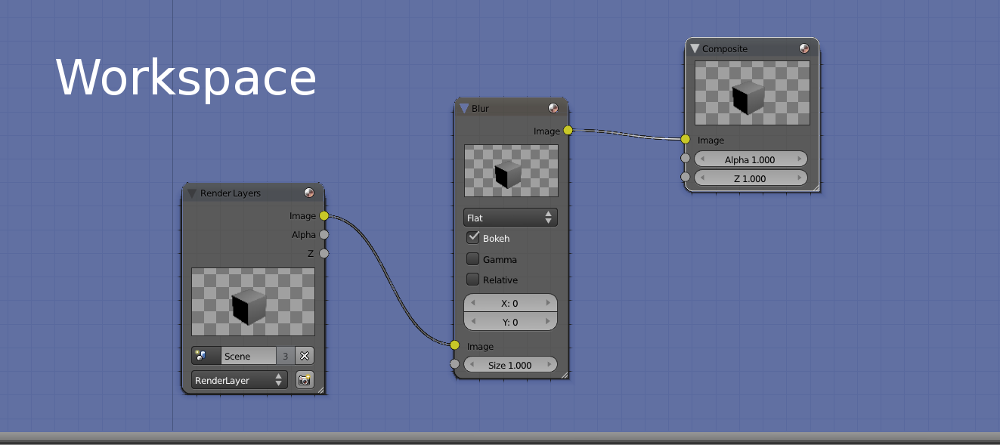
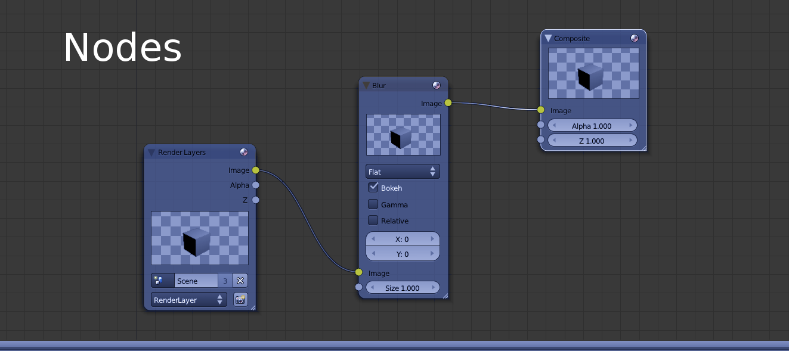
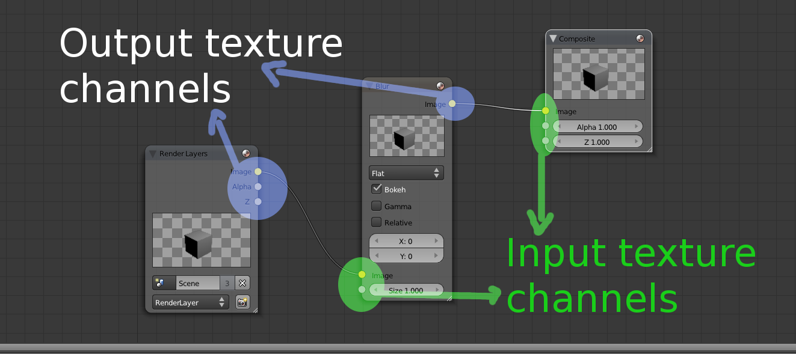
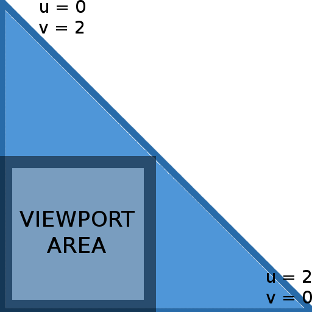

Compositor {#compositor}
==========

The Compositor is a Core and key component in Ogre 2.0. In 1.x, it was
just used for fancy post-processing effects. In 2.0, it's the way to
tell Ogre how you want to render the scene. Without setting it up, Ogre
won't render to screen.

With the Compositor, the user stops having to deal with setting
Viewports, RenderTargets, updating these RenderTargets every frame, etc.

Instead the user has now to setup Nodes and a Workspace. The workspace
is the top level system where the user indicates which Nodes he wants to
use, how they will be connected, which global render textures will be
declared (which can be seen by all nodes from the same workspace), where
to render the final output (i.e. RenderWindow, an offscreen
RenderTexture) and which SceneManager to use. The user can have multiple
workspaces active at the same time.

The new Compositor system was heavily inspired by Blender's Compositor
system. Picture from Blender:





Compositor script syntax hasn't changed much, which
should make porting them quite easy. Internally though, the new system
was written from scratch (while reusing & reviewing some of the existing
code); as the previous Compositor was stack-based, while the new one is
node-based.

So, if you used to manipulate the Compositor directly from C++; porting
efforts could be considerably bigger.

@tableofcontents

# Nodes {#CompositorNodes}

A compositor node most likely resembles what used to be "a compositor"
in 1.x

The following node clears the RT and draws everything that is in the
render queue \#50

```cpp
compositor_node MyNode
{
	in 0 Input_as_MyLocaName // Take input texture #0 and use the local name "Input_as_MyLocaName" for reference
	
	target Input_as_MyLocaName
	{
		//Clear to violet
		pass clear
		{
			colour_value 1 0 1 1
		}
		pass render_scene
		{
			visibility_mask	0xffffffff	 //Viewport's visibility mask

			rq_first		50		//Inclusive
			rq_last		51		//Not inclusive
		}
	}

	out 0 Input_as_MyLocaName
}
```

Where is `Input_as_MyLocaName` defined? What is its resolution? Its
bit depth? The RT comes from the input channel, so the answer is that it
depends on how the Workspace will connect this node. The Workspace may
pass a local RTT declared in a previous node or it could pass
RenderWindow.

## Input & output channels and RTTs {#CompositorNodesChannelsAndRTTs}

A node's RT may come from three different sources:

1.  It was locally declared.
2.  It comes from an input channel.
3.  It is a global texture declared in the Workspace. Global textures
    must use the ***global\_*** prefix

### Locally declared textures {#CompositorNodesChannelsAndRTTsLocalTextures}

The following script declares a local texture of resolution 800x600,
clears it to violet, and puts it in the output channel \#0 (so other
compositor nodes can use it as input):

```cpp
compositor_node MyNode
{
	texture rt0 800 600 PF_R8G8B8
	
	target Input_as_MyLocaName
	{
		//Clear to violet
		pass clear
		{
			colour_value 1 0 1 1
		}
	}

	out 0 rt0
}
```

You may have noticed the syntax for declaring the RTT is **almost
exactly the same** as it was in Ogre 1.x

Refer to Ogre's 1.9 documentation for more information about it.

There are a couple of small changes:

-   **New parameter** `no_gamma`: In 1.x HW gamma would be on by
    default if the global gamma settings were on; with no way to turn it
    off. But it could be forced always on using the keyword `gamma`. In
    Ogre 2.x, leaving the option blank uses the system's settings,
    writing the keyword `gamma` forces it on, and using the keyword
    `no_gamma` turns it off.
-   The parameter "scope" is no longer available.
-   The parameter "pooled" is no longer available.

### It comes from an input channel {#CompositorNodesChannelsAndRTTsFromInputChannel}

Input channels are numbered. An input channel must be given a name so
that they can be referenced locally at node scope by all target passes.
There can't be any gaps (i.e. use channels 0 & 2 but not 1)

Output channels are also numbered and can be assigned an RTT. This
number will be later used by the Workspace to perform the connections.

The workspace will be responsible for connecting node A's output
channels with node B's input channels. In **other words, channels are a
way to send, receive and share RTTs between nodes.**

The only restriction is that global textures can't be used neither as
input or output (global textures are referenced directly). There can be
more input channels than output channels, viceversa, and there may be no
input nor output channels (i.e. when working with global textures
alone).

The following (rather useless) snippet takes channel \#0 and sends it to
output channel \#1, takes input channel \#1 and sends it through output
channel \#0 (in other words it flips the channels), and also sends an
uninitialized texture created locally to channel \#2:

```cpp
compositor_node MyNode
{
	in 0 myFirstInput
	in 1 mySecondInput
	
	texture rt0 target_width_scaled 0.25 target_height_scaled 0.25 PF_R8G8B8

	out 0 mySecondInput
	out 1 myFirstInput
	out 2 rt0
}
```

Drawing inspiration from Blender's compositor system, the little dots on
the left would be the input channels, while the dots on right would be
the output texture channels:



### It is a global texture {#CompositorNodesChannelsAndRTTsGlobal}

Global textures are declared at workspace scope and have the same syntax
as local textures (which is the same Ogre 1.x's syntax). There are a few
restrictions:

1.  Global texture names must contain the ***global\_*** prefix.
    Inversely, any local texture or input channel trying to use a name
    that starts with `global_` is illegal.
2.  They can't be used in input or output channels.
3.  Global textures can be seen by any node belonging to the same
    workspace, but they can't see a global texture that belongs to a
    different workspace.
4.  If a Node uses a global texture that the Workspace didn't declare,
    execution of the workspace will fail.

Global textures are as powerful/dangerous as global variables are in
C++. The main reason of their existence is that many nodes may use
temporary rtts to perform their work, and it's *very* wasteful to
declare these intermediate rtts on every node when they can be shared
and reused.

Sharing and reusage can also be achieved through input & output
channels, however for temporary rtts (or rtts that are accessed very
frequently, i.e. a deferred shader's G Buffer) it would lead to
connection hell; and hence global textures are a much better fit.

-   in \<channel\_id\>; \<local\_texture\_name\>;

channel\_id is a number in range \[0; inf) but must be consecutive and
continuous (no gaps, i.e. define channel 0, 2, but not 1).
loca\_texture\_name cannot start with `global_`. A node definition may
have no input.

-   out \<channel\_id\>; \<local\_texture\_name\>;

channel\_id is a number in range \[0; inf) but must be consecutive and
continuous (no gaps, i.e. define channel 0, 2, but not 1).
loca\_texture\_name cannot start with `global_`. A node definition may
have no output.

-   in\_buffer \<channel\_id\>; \<buffer\_name\>;

For UAV buffers. Same as with regular textures, except you can reference
global buffers, and global buffers don't have to start with `global_`.
If a local buffer and a global buffer have the same name, the local
buffer takes precedence.

-   out\_buffer \<channel\_id\>; \<buffer\_name\>;

For UAV buffer connections. See `in_buffer`.

-   custom\_id \<string\>;

Custom string that will be hashed to identify this Node definition.
Useful for classifying nodes into categories.

### Main RenderTarget {#CompositorNodesChannelsAndRTTsMainRenderTarget}

When creating the Workspace instance, the C++ code will ask for the RT
which should be the ultimate target (i.e. the RenderWindow). This RT is
very important as keywords like `target_width_scaled` and settings
like fsaa & hw gamma will be based on the attributes from this main RT.
This feature will be seen in more detail in the Workspace section.

>  Attention \#1!
> 
>  By default you cannot use the main RenderTarget as a texture (because it's usually the RenderWindow and D3D and OpenGL don't allow it), and doing it may result in a crash.
>  
>  It is possible to manually call `node->connectFinalRT` and supply a texture pointer (i.e. if the final RenderTarget is a RenderTexture) that can be bound. An automated way of doing this is not yet implemented.

## Target {#CompositorNodesTarget}

Targets include multiple passes. Their main purpose is define to which
RenderTarget the passes will render to.

What's worth noting is that targets accept an optional parameter
'*slice*'.

The slice parameter is optional and refers to which slice or face from a
3D texture (or cubemap or 2D array) to use from the given texture. Valid
values can be numeric or the hint '+X'. '-X', '+Y', '-Y', '+Z', and
'-Z'.

Note: The word 'slice' must not be written. Just write 'target myTexture
+X' to work.

Note: When the target is a 3D/Cubemap/array texture, if the slice goes
out of bounds, an exception will be raised. If the target is a 2D or 1D
texture, this value is silently ignored. Default: slice = 0

## Passes {#CompositorNodesPasses}

Passes are the same as they were in Ogre 1.x. At the time of writing
there are 8 types of passes:

-   clear (PASS\_CLEAR)
-   generate\_mipmaps (PASS\_MIPMAP)
-   quad (PASS\_QUAD)
-   resolve (PASS\_RESOLVE)
-   render\_scene (PASS\_SCENE)
-   stencil (PASS\_STENCIL)
-   uav\_queue (PASS\_UAV)
-   custom (PASS\_CUSTOM)

More passes are planned including the ability for users to extend with
custom passes which used to be present in 1.x.

Planned passes are:

-   Paraboloid mapping passes (useful for efficient env. mapping and
    point light shadow maps)
-   N pass (optimizes Ogre data for two or more passes i.e. a Z pre-pass
    with minimum overhead in the engine since the cull data is the same)

All passes support the following script parameters:

-   pass \<type\>; \[customId\]

'*type*' must be one of the supported types: clear, quad, resolve,
render\_scene, stencil, custom.

The *customId* parameter is optional and is used by custom passes to
give the registered custom pass provider the means to identify multiple
types, in case there are more than one type of custom passes.

-   num\_initial \<number\>;

Number of times this will be executed. Default is -1, which means always
execute. When the execution count hits that value, it won't executed
again until a d3d device reset, resize or workspace recreation (the
execution count is reset and executed N times again)

This parameter replaces the `only_initial` parameter in Ogre 1.x.

-   identifier \<number\>;

An arbitrary user-defined numeric ID used for identifying individual
passes in the C++ code.

-   execution\_mask \<hex number\>;

8-bit hex value. Specifies the execution mask. For more information see
[Stereo and Split-Screen Rendering for more
information](#4.5.Stereo and Split-Screen Rendering|outline). Default is
0xFF except for clear passes, which default to 0x01.

-   viewport\_modifier\_mask \<hex number\>;

8-bit hex value. Specifies the viewport modifier mask. For more
information see [Stereo and Split-Screen Rendering for more
information](#4.5.Stereo and Split-Screen Rendering|outline). Default is
0xFF except for clear passes, which default to 0x00.

-   colour\_write \<off|on\>;

Disables colour writes. Useful for Z prepass passes; or pixel shaders
that output to an UAV instead of a regular RenderTarget (like a Render
Texture).

Default: on.

-   profiling\_id "name";

User defined text for identifying this pass by name in profilers and
GPU debuggers

### clear {#CompositorNodesPassesClear}

The syntax for clear passes is the same as 1.x; except that by default
now Stencil is also cleared. This follows performance reasons, as GPU
architectures where the Z buffer is tied with the stencil buffer,
clearing only the Z buffer hinders the driver from discarding the buffer
entirely or using fast Z clears.

Additionally, all passes can define the viewport area they will work on,
meaning clearing specific regions is now possible.

### generate_mipmaps {#CompositorNodesPassesGenerateMipmaps}

Generate\_mipmaps doesn't have special parameters other than the shared
ones that are still relevant (i.e. identifier). They're useful for
explicitly populating the lower mip levels after you've done rendering.

This pass does not require the *automipmap* keyword when declaring the
textures. The 'automipmaps' option allows you to skip using
generate\_mipmaps entirely. It can be tempting, but the problem with
this option is that if you write and read to/from the texture several
times but only want to genrate mipmaps after the whole process is over,
the automipmap keyword will generate mipmaps every time the texture
needs to be read again after it was being tagged as dirty for having
written to it.

Disabling automipmap and using generate\_mipmaps instead allows you to
explicitly control when the mipmaps are generated; without hidden
surprises eating GPU performance away.

-   mipmap\_method \[api\_default|compute|compute\_hq\]

Default is `api_default` which will ask the API or driver to generate
them for you. If the API does not support it (e.g. DX12) then Compute
will be used.

`compute` (Experimental) uses a compute shader. Compute requires the
texture to be UAV. Some formats may not work, such as sRGB formats,
therefore textures have to use no\_gamma modifier.

`compute_hq` (Experimental) uses a high quality gaussian filter. Useful
for fast & high quality mipmap generation.

-   kernel\_radius \<8\>;

Integer value. Default is 8. Must be positive, even number. Defines the
kernel radius of the compute gaussian filter.

-   gauss\_deviation \<0,5\>;

The standard deviation of the gaussian filter. The default is 0,5.

>  Attention \#1!
>  
>  generate\_mipmaps works at texture level. If you pass a Cubemap, it will generate mipmaps for all the faces. If you pass a 3D or a 2D array texture, it will generate mipmaps for all slices.
>  
>  A RenderWindow does not have a texture, thus attempting to generate mipmaps on it will raise an exception.
>  
>  Attention \#2!
>  
>  In order for compute-based mipmap generation to work, Ogre must be compiled with JSON support, and the user must include the resources included in Ogre's repository at Samples/Media/2.0/scripts/materials/Common

### quad {#CompositorNodesPassesQuad}

Quad passes have the same syntax as 1.x; plus the following keywords
have been added:

-   use\_quad \[yes|no\]

Default is *no*. When *no*; the compositor will draw a fullscreen
*triangle*. Due to how modern GPUs work, using two rectangles wastes GPU
processing power in the diagonal borders because pixels are processed
*at least* in 2x2 blocks; and the results from the pixels out of the
triangle have to be discarded. A single triangle is more efficient as
all blocks are fill the viewport area, and when the rectangle goes out
of the viewport, the gpu efficiently clips it.

When the viewport is not `0 0 1 1`; this value is forced to *yes*. The
following picture illustrates a fullscreen triangle:



Interpolation will cause that the effective UV
coordinates will be in the \[0; 1\] range while inside the viewport
area.

Using `camera_far_corners_world_space` will also force to use a quad
instead of a tri (but `camera_far_corners_view_space` works with tris)

For an explanation of why this is a performance optimization, refer to
[Optimizing the basic rasterizer](http://fgiesen.wordpress.com/2013/02/10/optimizing-the-basic-rasterizer/)
by Fabien Giesen.

-   expose \<textureName\>;

Low level materials can access local and global textures via the old
'content\_type compositor' setting, and Hlms materials can access them
by calling `SceneManager::getCompositorTextures`. But before you can do
that, you need to expose them to the pass. This is necessary so Ogre can
know which textures may or will be used during the pass so resource
transitions and barriers can be issued in explicit APIs like DX12 and
Vulkan.

The following setting was available in Ogre 1.x; but was not documented:

-   quad\_normals
    \[camera\_far\_corners\_view\_space|camera\_far\_corners\_view\_space\_normalized|camera\_far\_corners\_view\_space\_normalized\_lh|camera\_far\_corners\_world\_space|camera\_far\_corners\_world\_space\_centered|camera\_direction\]

Sends through the `NORMALS` semantic the camera's frustum corners in
either world space or view space. This is particularly useful for
efficiently reconstructing position using only the depth and the
corners. The `camera_direction` option sends the direction across the
frustum and is the same as `camera_far_corners_world_space_centered`
but normalized (values are in range \[0;1\]) which is useful for sky
rendering & atmospheric scattering. See `TutorialSky_Postprocess` sample.

Interesting read: Reconstructing Position From Depth [Part
I](http://mynameismjp.wordpress.com/2009/03/10/reconstructing-position-from-depth/),
[Part
II](http://mynameismjp.wordpress.com/2009/05/05/reconstructing-position-from-depth-continued/),
[Part
III](http://mynameismjp.wordpress.com/2010/09/05/position-from-depth-3/)

`camera_far_corners_view_space_normalized` is like
`camera_far_corners_view_space` but divides the whole vector by the
far plane; causing dir.z to be always -1 (but the vector itself isn't
unit-length). The one with `_lh` suffix is the left-handed variant (i.e.
dir.z = 1 instead of -1)

Starting Ogre 2.0, UV coordinates are always sent to the vertex shader
in pass quads.

>  Attention!
>  
>  In Ogre 2.x; you need to apply the **world-view-proj matrix** so that the the pass being drawn compensates for texel-to-pixel aligning reads in Direct3D9. Failing to do so will not only cause the aforementioned alignment issue, but also will cause glitches when the viewport is not 0 0 1 1
>  
>  In Ogre 1.x, only the proj matrix was necessary to fix texture flipping issues when rendering to FBOs in OpenGL.

### resolve {#CompositorNodesPassesResolve}

>  **Note:** at the time of writing, resolve passes have not been fully implemented

TBD

When the Render System doesn't support explicit resolves (or textures
were created with no msaa setting), textures are treated as implicitly
resolved and all resolve passes are ignored.

See [*MSAA: Explicit vs Implicit
resolves*](#3.1.3.1.MSAA: Explicit vs Implicit resolves|outline) section
for more information.

### render_scene {#CompositorNodesPassesRenderScene}

The syntax is also similar to 1.x; but there were a couple
modifications:

-   rq\_first \<id\>;

Replaces first\_render\_queue. The default is 0. Must be a value between
0 and 255. The value is inclusive

-   rq\_last \<id\>;

Replaces last\_render\_queue. The default is `max` which is a special
parameter that implies the last active render queue ID. If numeric,
value must be between 0 and 255. The value is **not** inclusive.

-   viewport \<left\>; \<top\>; \<width\>; \<height\>;
    \[\<scissor\_left\>; \<scissor\_top\>; \<scissor\_width\>;
    \<scissor\_height\>;\]

Specifies the viewport. Also supported by all other passes (i.e. clear &
quads), The default is `0 0 1 1` which covers the entire screen. Values
should be between 0 and 1.

When 4 parameters are suplied, the scissor box will match the
viewport's. All 8 parameters allow to set a custom scissor box. *Note:*
Scissor testing must be enabled by the Hlms Macroblock for it to work,
we just set the size here.

The Compositor will automatically share Viewport pointers between
different passes to the same RenderTarget (even for different nodes) as
long as they share the exact same parameters.

-   visibility\_mask \<number\>;

Visibility mask to be used by the pass' viewport. Those entities that
fail the test '*entityMask & visibility\_mask*' will not be rendered.
There are no significant changes to Ogre 1.x, except that the script
compiler now accepts hexadecimal values with the 0x prefix; not just
decimal values.

-   light\_visibility\_mask \<number\>;

Visibility mask to be used by the pass for culling lights in Forward+.
Those entities that fail the test '*entityMask & light\_visibility\_mask*'
will not be used as non-shadow-casting lights during this pass.
This will give you a relatively efficient way to control with coarse
granularity which lights affect which objects.
Note that this uses the mask set via light->setVisibilityMask, not
the one set via light->setLightMask.

-   shadows \<off|shadow\_node\_name\>;
    \<reuse|recalculate|first\>;

Off by default. Specifies the shadow node to use for rendering with
shadow maps. See section about [*Shadow
Nodes*](#3.2.4.Reuse, recalculate & first|outline) for more information.
When a shadow node's name is provided, the second parameter defaults to
*first*.

-   overlays \<off|on\>;

Whether to Overlays from the OverlaySystem component. On by default for
regular nodes, Off by default on shadow nodes. The goal is that
eventually Overlays obey RenderQueue IDs like everything else, but it
was too hard to port (Overlay system is tad bit complex...) so this
hack/flag was created. It will be eventually removed.

-   camera \<camera\_name\>;

When not specified, the default camera is used for rendering the pass
(this default camera is specified when instantiating the workspace from
C++).

When a name is given, the Compositor will look for this camera and use
it. Very useful for reflection passes (mirrors, water) where the user
wants to be in control of the camera, while the Compositor is associated
with it. The Camera must be created by the user before the workspace is
instantiated and remain valid until the workspace is destroyed.

-   lod\_camera \<camera\_name\>;

The camera point of view from which the LOD calculations will be based
from (i.e. useful for shadow mapping, which needs the LOD to match that
of the user camera). When an empty string is provided, Ogre will assume
the lod camera is the same as the current camera, except for shadow
nodes in which it will assume it's the lod\_camera from the normal pass
the shadow node is attached to. Default: Empty string.

-   lod\_update\_list \[yes|no\]

When No (or false), the LOD list won't be updated, and will use the LOD
lists of calculated by a previous pass. This saves valuable CPU time.
Useful for multiple passes using the same lod\_camera (without a pass in
the middle with a different lod\_camera that would override the cached
LOD lists). If your application is extremely CPU bound, and hence you
don't need LOD, turning this setting to false in all passes will
effectively turn lodding off (and alleviate the CPU). Default: Yes;
except for passes belonging to shadow nodes, which is forced to false
unless lod\_camera is a non-empty string.

-   lod\_bias \<bias\>;

Applies a bias multiplier to the lod. Valid values are in range \[0;
Inf). A higher lod bias causes LOD to pop up sooner. Default: 1.0

-   camera\_cubemap\_reorient \[yes|no\]

When Yes, the camera will be reoriented for rendering cubemaps,
depending on which slice of the render target we're rendering to (3D,
Cubemaps and 2D-array textures only). Its original orientation is
restored after the pass finishes. The rotations are relative to its
original orientation, which can produce counter-intuitive results if the
Camera wasn't set to identity (unless that's the desired effect). See
[Passes](#4.1.2.Passes|outline) section on how to indicate which slice
should we render to. Default: No.

**Note:** if the target is not a cubemap, Ogre will still try to rotate
the camera, often to unintended angles.

-   enable\_forward3d \[yes|no\]

When yes, this pass will use Forward3D (must be enabled first by the
developer via C++, see Forward3D sample). When No, Forward3D will not be
used for this pass, which can improve performance both CPU and GPU side
(but many lights are likely not going to be drawn or used). Default:
Yes.

**Details:** CPU side, lights won't be culled against the camera (only a
saving if F3D didn't already have a cache from a previous pass during
the same frame, with the exact same camera and angle). GPU side, the
pixel shaders will be lighter.

-   expose \<textureName\>;

Low level materials can access local and global textures via the old
'content\_type compositor' setting, and Hlms materials can access them
by calling SceneManager::getCompositorTextures. But before you can do
that, you need to expose them to the pass. This is necessary so Ogre can
know which textures may or will be used during the pass so resource
transitions and barriers can be issued in explicit APIs like DX12 and
Vulkan.

-   is_prepass \[yes|no\];

Indicates this is a prepass render. HlmsPbs implementation will render a GBuffer
with normals and shadow mapping information.
See ScreenSpaceReflections sample for an example on how to use it.

-   use_prepass \<GBuffer\> \[reflectionBuffer\]

Indicates this pass will take advantage of the data generated during the prepass,
which means depth buffer writes may be forced to off; normals will be sourced
for the GBuffer. And if present, a reflection texture will be used for calculating
SSR (Screen Space Reflections).

### stencil {#CompositorNodesPassesStencil}

Stencil passes are little more flexible than in Ogre 1.x; always
remember to restore the stencil passes before leaving the node otherwise
next nodes that will be executed may use unexpected stencil settings.

Most relevant changes are that two sided stencil can now be definted
with more flexibility (it's not a boolean anymore), and that syntax has
slightly changed to accomodate for this change:

```cpp
pass stencil
{
	check		true
	mask		0xff
	read_mask	0xff
	
	both
	{
		fail_op		keep
		depth_fail_op	increment
		pass_op		decrement_wrap
	}
}
```

The `read mask` is new, and now the `fail_op`, `depth_fail_op` & `pass_op`
must be enclosed between brackets.

Valid values are 'both' 'front' and 'back'. 'both' is just a shortcut
for defining front and back at the same time with less typing.

### uav_queue {#CompositorNodesPassesUavQueue}

This is a new feature introduced in Ogre 2.1. s stands for <b>U</b>nordered
<b>A</b>ccess <b>V</b>iews, in D3D's jargon. OpenGL users know UAVs as the
feature combination of *image* textures (imageLoad, imageStore) and
SSBOs (Shader Storage Buffer Object). UAVs are powerful beasts because
they allow random read and write access from a shader, and even support
atomic operations. Proper use of them can achieve incredible results
that couldn't be done without UAVs, but improper use can severely hurt
performance.

There's quite a discrepancy between D3D11 & OpenGL in how they treat
UAVs from API interface perspective. D3D11 equals UAVs to RenderTargets;
while OpenGL equals them more like textures.

In fact, the D3D11 API call to bind UAVs must set RenderTargets at the
same time. There is no API call to only set UAVs. To make things harder,
D3D11 forces UAVs to share slots with RenderTargets; and there are up to
8 slots in total (64 when using D3D11.1 on Windows 8.1). Which means if
you're using an MRT with 3 targets, you only have 5 slots left for UAVs.

We can guess for performance improvements: this way D3D11 can check for
hazards when setting RTs and UAVs (i.e. make sure you don't bind the
same resource as both RT and UAV) while they still use the same hazard
checking they do for textures to check that you're not binding a texture
at the same time it is bound as an RT/UAV.

If the UAV equals a texture, as in OpenGL; they would have to check
textures against textures every time a texture changes, which is O( N! )
complexity; and also a very common operation. Considering past
experiences, we're guessing OpenGL just simply skips the check and lets
the hazard happen (which is cool when there are hardware extensions that
allow you to read/write from these resources at the same time as long as
you abide to certain rules).

Because D3D11 is more restrictive than OpenGL, our interface resemble's
D3D11.

-   starting\_slot \<number\>;

Offset for all UAV slots. For example if you bind an uav to slot 3 and
the starting slot is 2; the uav will actually be bound to uav slot 5.
When set to 255, the slot offset is ignore and leaves the last setting
made.

Default: 255 (by default Ogre sets it to 1).

-   uav \<slot\>; \<texture\_name\>; \[mrt \#\] \<read\>;
    \<write\>; \[pixel\_format\] \[\<mipmap\>; \#\]

Sets a texture visible in the current compositor scope (i.e. global
textures, input textures, local textures). Slot, name and at least read
or write flags must be present. The others are optional and default to 0
(mrt & mipmap) and `PF_UNKNOWN` (format, `PF_UNKNOWN` means the UAV will
use the original texture's pixel format instead of trying to reinterpret
the data).

The keyword mipmap must be present if specifying the mipmap level.

Example, assuming `starting_slot` is 1:

```cpp
uav 0 global_myTexture 2 read write mipmap 5
```

Will bind the mrt slice \#2 of the global texture 'global\_myTexture' to
slot 1[^5], will have both read & write access, and use mipmap level 5.

If only the slot is specified, any UAV at the given slot will be
cleared.

-   uav\_external

Exactly the same as uav. But instead of sourcing the texture by name
from the Compositor scope, the name is referencing a texture that can be
accessed via `TextureManager::getByName`.

-   uav\_buffer \<slot\>; \<bufferName\>; \<read\>;
    \<write\>; \[offsetBytes\] \[sizeBytes\]

Sets an UAV buffer visible in the current compositor scope (i.e. global
buffers, input buffers, local buffers). Slot, name and at least read or
write flags must be present. The others are optional and default to 0.
When sizeBytes = 0; we assume you want to bind from the offset until the
end of the buffer.

Example, assuming starting\_slot is 1:

```cpp
uav_buffer 0 myUavBuffer read write 256 512
```

Note there may be HW alignment restriction on which offset you specify.
Multiples of 256 bytes are a safe bet.

Note that uav\_buffer slots are shared with uav texture's. Binding both
to the same slot index will only result in one of them being available.

If only the slot is specified, any UAV at the given slot will be
cleared.

-   keep\_previous\_uavs \[true|false\]

When false, all previous UAVs in all slot will be cleared. When true,
only the UAV slots modified by this pass will be affected. Default:
true.

#### Synchronization {#CompositorNodesPassesUavQueueSync}

UAVs make little guarantees about the order of read and writes. Often
memory barriers need to be placed to result in correct rendering.

OpenGL uses a coarse barrier (affects all resources that will be used as
a specific type); while D3D12 uses a fine barrier (per resource).
Therefore we need to take D3D12's approach.

The Compositor can detect when an UAV will be used in a `PASS_QUAD` pass
as a texture, and thus it will automatically insert memory barriers.
However it cannot detect if the pass will use an UAV that was just been
used for writing as an UAV for reading, and hence the user must insert a
barrier manually. (TODO: No interface to do this yet!)

The compositor textures that are explicitly made visible to passes to be
used as textures (i.e. in a `CompositorPassScene`) can also be detected
and a memory barrier will automatically be placed.

TODO: !!!Interface WIP. Code may not work as described in this
section!!!

>  **Note:** at the time of writing, memory barriers are a Work In Progress. Documentation may change!

### compute {#CompositorNodesPassesCompute}

Compute passes let you run a compute job. It can read textures,
read/write to UAV textures, and read/write to UAV buffers.

-   job \<job\_name\>;

Sets the name of the compute job to run (an HlmsComputeJob).

-   uav \<slot\>; \<texture\_name\>; \[mrt \#\] \<read\>;
    \<write\>; \[pixel\_format\] \[\<mipmap\>; \#\]
    \[allow\_write\_after\_write\]

See `uav_queue`'s description. The presense of `allow_write_after_write`
means the compositor will not insert a barrier between to consecutive
passes that writes to the UAV without reading.

-   uav\_buffer \<slot\>; \<bufferName\>; \<read\>;
    \<write\>; \[offsetBytes\] \[sizeBytes\]
    \[allow\_write\_after\_write\]

See `uav_queue`'s description. The presense of `allow_write_after_write`
means the compositor will not insert a barrier between to consecutive
passes that writes to the UAV without reading.

-   input \<slot\>; \<texture\_name\>; \[mrt \#\]

Binds a texture to the texture unit. Syntax is the same as `pass_quad`.
The slot is not shared with the uav's.

Compute passes don't really belong to a render target. However due to
the Compositor's design, they must be specified within a render target.
You may do so within a valid render target:

```cpp
compositor_node MyNode
{
	in 0 rt_renderwindow
	texture myUavTexture target_width target_height PF_R8G8B8A8 depth_pool 0 no_gamma uav
	buffer myUavBuffer 1024 4
	
	target rt_renderwindow
	{
		//Run compute job with myUavTexture & myUavBuffer bound.
		pass compute
		{
			job myComputeJobName
			uav 0 myUavTexture read write
			uav_buffer 1 myUavBuffer read write
		}
		//Clear  rt_renderwindow to violet
		pass clear
		{
			colour_value 1 0 1 1
		}
	}

	out 0 myUavTexture
	out_buffer 0 myUavBuffer
}
```

Or to a null dummy render target, which occupies almost no memory:

```cpp
compositor_node MyNode
{
	texture nullDummy target_width target_height PF_NULL
	texture myUavTexture target_width target_height PF_R8G8B8A8 depth_pool 0 no_gamma uav
	buffer myUavBuffer 1024 4
	
	target  nullDummy
	{
		//Run compute job with myUavTexture bound.
		pass compute
		{
			job myComputeJobName
			uav 0 myUavTexture read write
			uav_buffer 1 myUavBuffer read write
		}
	}

	out 0 myUavTexture
	out_buffer 0 myUavBuffer
}
```

>  Attention \#1!
>  
>  Do NOT set UAV buffers to the compute job directly (the class HlmsComputeJob). The Compositor needs to evaluate memory barriers and resource transitions. Leaving inconsistent memory barriers can result in hazards/race conditions in some APIs. If in doubt, change the CompositorPassComputeDef instead.
>  
>  Also setting Textures that are RenderTargets is dangerous. For RenderTargets, change the CompositorPassComputeDef instead.
>  
>  Attention \#2!
>  
>  Don't interleave compute and graphics passes. For optimum performance, try to batch everything together.

## Textures {#CompositorNodesTextures}

```cpp
texture <name> <width> <height> [depth] <pixel_format> [<mrt_pixel_format2>] [<pixel_formatN>] [no_gamma]
[no_fsaa] [depth_texture] [depth_pool <poolId>] [uav] [2d_array|3d|cubemap] [mipmaps <numMips>] [automipmaps]
[explicit_resolve]
```

-   \<name\>

A locally unique name must be assigned (and cannot start with *global\_* prefix).

-   \<width\> \<height\>

The dimensions of the render texture. You can either specify a fixed width and height,
or you can request that the texture is based on the physical dimensions of the viewport
to which the compositor is attached. The options for the latter are ’target_width’,
’target_height’, ’target_width_scaled <factor>’ and ’target_height_scaled <factor>’ -
where ’factor’ is the amount by which you wish to multiply the size of the main target
to derive the dimensions.

-   \<depth\>

Used by 2d\_array and 3d textures. Specifies their depth / number of
slices. It's automatically forced to 1 for 2d textures and 6 for
cubemaps.

-   \<pixel_format\>

The pixel format of the render texture. This affects how much memory it will take,
what colour channels will be available, and what precision you will have within those channels.
Most common options are PF_A8R8G8B8, PF_R8G8B8A8, PF_FLOAT16_RGBA, PF_FLOAT16_RGB,
PF_FLOAT16_R, PF_FLOAT32_RGBA, PF_FLOAT32_RGB, PF_FLOAT32_R.

-   no_fsaa

When this keyword is present, the texture will not be using FSAA.
The FSAA setting is determined by the main render target.

-   no_gamma

By default Ogre will perform automatic HW gamma conversion for you (when supported by
the hardware) based on system settings. But when this is present, you can override
that behavior.

-   depth_pool

When present, this directive has to be followed by an integer. This one sets from
which Depth buffer pool the depth buffer will be chosen from. All RTs from all compositors
with the same pool ID share the same depth buffers as long as it's possible
(must have the same resolution, must have the same depth_texture setting).
RenderWindows can**not** share their depth buffers due to API limitations on some RenderSystems.
When the pool ID is 0, no depth buffer is used. This can be helpful for passes that don’t
require a Depth buffer at all, potentially saving performance and memory. Default value is 1.

-   depth\_texture

When present, the RTT indicates you want to later access the depth buffer's contents
as a texture in a shader.
RTTs using depth_texture with the same depth pool ID will share depth buffers, but
they won't share depth buffers with other RTTs of the same depth pool IDs who don't
have depth_texture setting.
This setting is implicit when using a depth pixel format such as PF\_D24\_UNORM\_X8

-   uav

When present, the texture can be used as an UAV.

-   2d\_array|3d|cubemap

When present, the texture will be created as a 2d\_array, 3d or cubemap.
Mostly relevant for UAVs but is also useful for rendering. See
[Target](#4.1.2.Target|outline) slice parameter.

-   mipmaps \<num Mipmaps\>

Default: 0; Indicates how many mipmaps to use. 0 for none. Use -1 to
fill all mipmaps until 1x1

-   automipmaps

When present, automipmapping is used. Every time you alter an RTT (e.g.
by rendering to it, by clearing it, etc), it is tagged as dirty. When
it's used as a texture again, mipmaps will be autogenerated. This can be
problematic in certain cases where ping ponging RTTs is involved and you
only want to get mipmaps generated at the end. In such cases, consider
using using a PASS\_ instead to manually generate them.

-   explicit\_resolve

When present, Ogre shall not resolve the MSAA contents every time you
want to access it as a texture; but rather when you do that explicitly,
thus until it's not manually resolved; you can access the internal
MSAA contents.

### MSAA: Explicit vs Implicit resolves {#CompositorNodesTexturesMsaa}

Not long ago, MSAA support was automatic, and worked flawlessly with
forward renderers and no postprocessing. Direct3D 9 and OpenGL were not
able to access the individual MSAA subsamples from shaders at all.

Fast forward to the present, MSAA resolving should be performed after
HDR to avoid halos around edges, and deferred shading can't resolve the
G-Buffer otherwise aliasing only gets worse.

Direct3D10 and GL 3.2 introduced the ability of access the MSAA
subsamples from a shader, also giving the ability to write custom
resolves.

For those unaware what "resolving MSAA" means; a very brief explanation
is that when rendering using 2xMSAA, we're actually rendering to a RT
that is twice the resolution. "Resolving" is the act of scaling down the
resolution into the real RT (i.e. think of Photoshop or Gimp's downscale
filter modes). See the Resources section at the end for links to
detailed explanations of how MSAA works.

To cleanly deal with this new feature without breaking compatibility
with D3D9 & older GL render systems while at the same time being able to
effortlessly switch MSAA on and off; the notion of "Explicit" and
"Implicit" resolves were added.

#### Implicit resolves {#CompositorNodesTexturesMsaaImplicit}

By default all RTTs are implicitly resolved. The behavior of implicitly
resolved textures mimics Ogre 1.x (except for implementation and design
issues in Ogre 1.x that could cause an RTT to resolve multiple times per
frame unnecessarily)

The RTT has an internal flag for being "dirty". The texture gets dirty
when rendering to it; and it stops being dirty when it is resolved.

When you attempt to bind a dirty RTTs as a texture, you're forcing Ogre
to resolve it. This means that you should try to delay using the RTT as
a texture as much as possible until you've done with rendering to it.

Otherwise the RTT may resolve more than once if you render to it: render
(gets dirty), use it as a texture, render to it again (gets dirty
again), and use again as a texture (all in the same frame). In some
cases this is unavoidable, but often it isn't.

#### Explicit resolves {#CompositorNodesTexturesMsaaExplicit}

Explicit resolves are used when you want to either implement a custom
resolve other than the API's default; or you want access to the MSAA
subsamples directly through shaders.

Like implicit resolves, RTTs have a dirty flag. However:

1.  Attempting to bind a dirty RTT as a texture will cause Ogre to send
    the MSAA buffer; granting the shader the ability to access
    subsamples.
2.  Attempting to bind a non-dirty dirty RTT as a texture will cause
    Ogre to send the resolved buffer. The shader won't be able to access
    subsamples.

In summary, shaders can access subsamples while a texture is dirty. To
clean the dirty flag and perform a resolve on the RTT, use the
[PASS\_RESOLVE pass](#3.1.2.3.resolve|outline). This is why they're
called "explicit" resolves; because you have to *explicitly *tell Ogre
to resolve an msaa target and unset the dirty flag[^6].

On RenderSystems where explicit resolving is not supported, all textures
will be treated as implicitly resolved and PASS\_RESOLVE passes will be
ignored; which should work straightforward and without issues except for
a few corner cases.

Use the RSC\_EXPLICIT\_FSAA\_RESOLVE Render system capability flag to
check if the API supports explicit resolves.

#### Resources {#CompositorNodesTexturesMsaaResources}

-   [A Quick Overview of
    MSAA](http://mynameismjp.wordpress.com/2012/10/24/msaa-overview/)
-   [Experimenting with Reconstruction Filters for MSAA
    Resolve](http://mynameismjp.wordpress.com/2012/10/28/msaa-resolve-filters/)

### Depth Textures {#CompositorNodesTexturesDepth}

Since Ogre 2.1; depth textures are supported. It has been a feature
missing from Ogre since a long time by now.

Depth textures are a bit particular because they may not "own" the depth
buffer. They're just a null render target with a "view" on an already
existing depth buffer. But... what does this mean?

Depth Buffers can be tricky. Suppose the following example:

```cpp
compositor_node Example
{
        texture myDepthTexture 512 512 PF_D32_FLOAT
        texture finalSSAO 512 512 PF_R8G8B8
        //Draw the depth
        target myDepthTexture
        {
                pass clear {}
                pass render_scene
                {
                }
        }
        
        target finalSSAO
        {
                pass clear {}
                pass render_quad
                {
                        material DepthAnalysis
                        input 0 myDepthTexture
                }
        }
        
        out 0 finalSSAO
}
```

Which simply does "Render a depth only pass to myDepthTexture; and read
the depth buffer contents with a render quad, and store the results in a
coloured RTT called 'finalSSAO' ".

That one was easy. But what about this one?

```cpp
compositor_node Example2
{
        texture firstPass 512 512 PF_R8G8B8
        texture finalColour 512 512 PF_R8G8B8
        //Draw everything, colour and depth
        target firstPass
        {
                pass clear {}
                pass render_scene
                {
                }
        }
        
        target finalColour
        {
                pass clear {}
                pass render_quad
                {
                        material SSAO
                        input 0 ??? // Depth, firstPass' depth texture?
                        input 1 firstPass
                }
        }
        
        out 0 finalColour
}
```

The first pass is a pass that includes both colour and depth. The second
one, we want to just take the depth and colour buffers separately as
input textures to the SSAO material pass.

But how do we take the depth buffer? For that, we need to do two steps:

1.  Request the original RTT that it wants to use a depth texture.
2.  Create a depth texture that will be a "view" to the depth buffer.
    Depth buffer sharing system should assign the same depth buffer to
    the RTT and the depth texture "view".

The solution is the following:

```cpp
compositor_node Example2_fixed
{
        //Instruct we want to use a depth texture (32-bit float). The "depth_texture" keyword is necessary.
        //Specifying The depth format is optional and so is the depth pool. However recommended to specify
        //them to avoid surprises.
        texture firstPass 512 512 PF_R8G8B8 depth_format PF_D32_FLOAT depth_texture depth_pool 1
        //Declare the depth texture view (which becomes so by using PF_D32_FLOAT as format).
        //Settings MUST match (depth format, pools, resolution). Specifying the depth pool is necessary,
        //otherwise the depth texture will get its own depth buffer, instead of becoming a view.
        texture firstPassDepthTexture 512 512 PF_D32_FLOAT depth_pool 1
        texture finalColour 512 512 PF_R8G8B8
        //Draw everything, colour and depth
        target firstPass
        {
                pass clear {}
                pass render_scene
                {
                }
        }
        
        target finalColour
        {
                pass clear {}
                pass render_quad
                {
                        material SSAO
                        input 0 firstPassDepthTexture
                        input 1 firstPass
                }
        }
        
        out 0 finalColour
}
```

>  Attention \#1!
>  
>  On a lot of Hardware, depth buffers are compressed (see [Depth In Depth](http://amd-dev.wpengine.netdna-cdn.com/wordpress/media/2012/10/Depth_in-depth.pdf) and [ATI Radeon HD 2000 Programming Guide](http://amd-dev.wpengine.netdna-cdn.com/wordpress/media/2012/10/ATI_Radeon_HD_2000_programming_guide.pdf)). Before AMD's GCN Taihiti hardware (AMD Radeon R9 280), **depth buffers need to be decompressed when bound for sampling as a depth texture.** Trying to use the depth texture as a depth buffer again without clearing it will degrade due to the lack of compression.
>  
>  It is suggested to copy the depth texture to another depth texture if you desire to use one for sampling and another to keep rendering, in order to maximize performance.
>  
>  The specifics of depth (de)compression for NVIDIA and Intel aren't known but it's probable they're bound to similar issues.
>  
>  TODO: Compositor interface to copy depth texture to another depth texture automatically.

# Shadow Nodes {#CompositorShadowNodes}

The only way to have shadows in Ogre is through shadow nodes.

Stencil shadows and "textured shadows" have been removed from Ogre 2.0;
only depth shadow maps are supported.

A shadow node is a special type of Node (in fact, the class inherits
from CompositorNode) that is executed inside a regular node (normally, a
render\_scene pass) instead of being connected to other nodes.

It is possible however, to connect the output from a Shadow Node to a
regular Node for further postprocessing (i.e. reflective shadow maps for
real time Global Illumination), but Shadow Nodes cannot have input.
*This particular feature (output to regular nodes) is still a work in
progress at the time of writing since ensuring the regular node is
executed after the shadow node has been executed can be a bit tricky*.

## Setting up shadow nodes {#CompositorShadowNodesSetup}

Shadow nodes work very similar to regular nodes. Perhaps their most
noticeable difference is how are RTTs defined. The following keywords
are supposed at shadow node scope:

-   technique \<uniform|planeoptimal|focused|pssm\>;

Specifies which shadow technique to use for the subsequent shadow map
declarations. The default is uniform.

>  **Note:** planeoptimal has also not been implemented yet.

-   num\_splits \<num\_splits\>

Only used by PSSM techniques. Specifies the number of splits per light.
Can vary per shadow map. The number of splits must be greater than 2.
Default is 3.

-   pssm\_lambda \<lambda\>

Only used by PSSM techniques. Value usually between 0 & 1. The default
is 0.95. PSSM's lambda is a weight value for a linear interpolation
between exponential and linear separation between each split. A higher
lambda will use exponential distribution, thus closer shadows will
improve quality. A lower lambda will use a linear distribution, pushing
the splits further, improving the quality of shadows in the distance.

-   pssm\_split\_blend \<blend\>

Only used by PSSM techniques. Value between 0 & 1. The default
is 0.125; use 0 to disable it. PSSM's blend defines, in the closest N-1
splits, the blend band size. E.g., a value of 0.1 means that the
farthest 10% of the first split is blended with the second split (and
so on for the other splits). A higher blend reduces visible seams
between splits at a cost of a slightly less defined shadow. See
[Blend between Cascades]
(https://msdn.microsoft.com/en-us/library/windows/desktop/ee416307(v=vs.85).aspx)
for additional info.

-   pssm\_split\_fade \<fade\>

Only used by PSSM techniques. Value between 0 & 1. The default
is 0.313; use 0 to disable it. PSSM's fade defines how much of the last
split will fade out. E.g., a value of 0.1 means that the farthest 10% of
the last split will fade out. A higher fade makes the transition from
shadowed to non shadowed areas (and viceversa) smoother at a cost of a
less visible distant shadow.


```cpp
shadow_map <number> <texture_name> light <lightIndex> [split <index>]
shadow_map <number> [atlas <texture_name> <left> <top> <width> <height>] light <lightIndex> [split <index>]
```

Shadow maps declaration order is important. The first shadow map
declared becomes shadow map \#0; the second shadow map declared becomes
\#1; and so on. Most of the settings are the same as for regular
textures. So only the new settings or the ones that behave differently
will be described:

-   texture_name

What texture to use that has already been declared,
where the shadow map contents will be stored.

-   atlas \<texture_name\> \<left\> \<top\> \<width\> \<height\>

Instead of using the whole atlas content, you can use a region of it.
The values are in range \[0;1\]

-   light \<index\>;

Indicates which light index will be associated with this shadow map.
i.e. the Shadow map \#0 may contain the Nth closest shadow mapping light
to the entity, not necessarily the first one.

-   split \<split index\>;

Default: 0; only necessary when using PSSM techniques. Indicates which
split this shadow map refers to.

```cpp
shadow_map <shadowMapName0> <shadowMapName1> {}
```

Declaring a shadow map is not enough. You need to tell Ogre what do you
want to render to it. And for that you need render\_scene passes.

Shadow nodes can be written with the regular `target { pass
render_scene {} }` syntax. However when you have 6 shadow maps with the
same exact pass settings, it's cumbersome to write the pass six times.
Instead the `shadow_map` keyword repeats the passes for you.

## Example {#CompositorShadowNodesExample}

The following is a basic script that will set a single shadow map with a
focused setup:

```cpp
compositor_node_shadow myShadowNode
{
	technique focused
    texture focusedTex 2048 2048 PF_D32_FLOAT no_fsaa
    shadow_map 0 focusedTex light 0
	//Render shadow map "0"
    shadow_map_target_type directional spot
    {
        shadow_map 0
        {
            pass clear { colour_value 1 1 1 1 }
            pass render_scene
            {
                rq_first 0
                rq_last max
            }
        }
    }
}
```

The typical setup is to have one directional light for the sun, and then
multiple point or spot lights. This means directional light should use a
PSSM setting for best quality, while point & spot lights shadow maps
could use focused or uniform.

The following script creates 3 shadow maps for 3 PSSM splits, and 3
additional ones for the remaining lights:

```cpp
compositor_node_shadow myShadowNode
{
	//Change to focused from now on
	technique focused
	shadow_map 3 1024 1024 PF_FLOAT16_R light 1
	shadow_map 4 1024 1024 PF_FLOAT16_R light 2
	shadow_map 5 512 512 PF_FLOAT16_R light 3

	//Render shadow maps "myStringName", "1", "2", "3", "4" and "5"
	shadow_map myStringName 1 2 3 4 5
	{
		pass clear { colour_value 1 1 1 1 }
		pass render_scene
		{
			rq_first 0
			rq_last max
		}
	}
    technique pssm

    texture pssm0 2048 2048 PF_D32_FLOAT
    texture pssm1 1024 1024 PF_D32_FLOAT
    texture pssm2 1024 1024 PF_D32_FLOAT

    texture spot0 2048 2048 PF_D32_FLOAT
    texture spot1 2048 2048 PF_D32_FLOAT

    num_splits		3
    pssm_lambda		0.95
    //Render 1st closest light, splits 0 1 & 2
    shadow_map 0 pssm0 light 0 split 0
    shadow_map 1 pssm1 light 0 split 1
    shadow_map 2 pssm2 light 0 split 2

    //Change to focused from now on
    technique focused
    shadow_map 3 spot0 light 1
    shadow_map 4 spot1 light 2

    shadow_map_target_type directional
    {
        //Render shadow maps 0, 1 and 2.
        //Can only be used by directional lights.
        shadow_map 0 1 2
        {
            pass clear
            {
                colour_value 1 1 1 1
            }
            pass render_scene
            {
            }
        }
    }

    shadow_map_target_type directional spot
    {
        //Render shadow maps 3 and 4
        //Can only be used by either directional lights or spot lights.
        shadow_map 3 4
        {
            pass clear
            {
                colour_value 1 1 1 1
            }
            pass render_scene
            {
            }
        }
    }
}
```

## Shadow map atlas & Point Lights {#CompositorShadowNodesAtlasAndPointLights}

Instead of rendering each PSSM split into a different texture, you can use an atlas:

```cpp
compositor_node_shadow PssmWithAtlas
{
    technique pssm

    texture atlas 3072 2048 PF_D32_FLOAT no_fsaa

    //The splits are distributed in the atlas like this:
    //  -------------
    //  |     |  2  |
    //  |  1  |-----|
    //  |     |  3  |
    //  -------------
    num_splits		3
    pssm_lambda		0.95
    shadow_map 0 atlas uv 0.000000000000000 0.0 0.666666666666667 1.0 light 0 split 0
    shadow_map 1 atlas uv 0.666666666666667 0.0 0.333333333333333 0.5 light 0 split 1
    shadow_map 2 atlas uv 0.666666666666667 0.5 0.333333333333333 0.5 light 0 split 2

    //Before doing anything, clear the whole atlas in one go. This is not
    //recommended on iOS & Android though; but recommended on Desktop.
    target atlas
    {
        pass clear
        {
            colour_value 1 1 1 1
        }
    }

    shadow_map_target_type directional
    {
        shadow_map 0 1 2
        {
            pass render_scene
            {
                //The viewport settings will be automatically
                //adjusted to constrain to the atlas regions.
            }
        }
    }
}
```

Point light shadow mapping has to exploit the powerful compositor scripting
capabilities: Ogre uses DPSM (Dual Paraboloid Shadow Maps).
Please note we will be rendering to cubemaps, then converting to DPSM.

We won't be rendering directly to DPSM as testing shows it deforms too much when
tessellation is low. We could support it, but it's not a priority.
So Ogre first needs to render to a cubemap, which can be shared by all shadow maps,
and then a converter transforms it to DPSM.

The reason to use scene -> Cubemap -> DPSM is so that we keep a reasonable memory
footprint and be atlas friendly. If we use cubemaps directly and want to support
8 point lights at 1024x1024, then we would have to do 1024x1024x6x8 = 192MB.
However with DPSM it would be 8 DPSM and 1 cubemap: 1024x1024x4x8 + 1024x1024x4x6 = 56MB.

So, to setup a point light with a temporary cubemap, it goes as follows:

```cpp
abstract target cubemap_target_shadow
{
    pass clear { colour_value 1 1 1 1 }
    pass render_scene
    {
        camera_cubemap_reorient true
    }
}
compositor_node_shadow PointLight
{
    technique pssm

    texture pointLightTex0 2048 2048 PF_D32_FLOAT no_fsaa
    texture pointLightTex1 2048 2048 PF_D32_FLOAT no_fsaa
    texture tmpCubemap 1024 1024 PF_FLOAT32_R cubemap no_fsaa

    technique focused
    shadow_map 0 pointLightTex0 light 0
    shadow_map 1 pointLightTex1 light 1

    shadow_map_target_type point
    {
        //shadow_map_repeat tells to repeat what's inside its body for shadow map 0 & 1
        shadow_map_repeat 0 1
        {
            //Render to the cubemap with the camera settings of
            //the currently iterated point light shadow map
            target tmpCubemap +X : cubemap_target_shadow {}
            target tmpCubemap -X : cubemap_target_shadow {}
            target tmpCubemap +Y : cubemap_target_shadow {}
            target tmpCubemap -Y : cubemap_target_shadow {}
            target tmpCubemap +Z : cubemap_target_shadow {}
            target tmpCubemap -Z : cubemap_target_shadow {}

            //Render to the current shadow map being iterated.
            shadow_map
            {
                pass render_quad
                {
                    //This material can be found in Samples/Media/2.0/materials/Common
                    material Ogre/DPSM/CubeToDpsm
                    input 0 tmpCubemap
                }
            }
        }
    }
}
```

See Samples/Media/2.0/scripts/Compositors/ShadowMapDebugging.compositor for an
example of a full script that can support directional, spot & point lights all
in one, in a single atlas.


## Reuse, recalculate and first {#CompositorShadowNodesReuseEtc}

Each `PASS_SCENE` from regular nodes have three settings:

1.  `SHADOW_NODE_REUSE`
2.  `SHADOW_NODE_RECALCULATE`
3.  `SHADOW_NODE_FIRST_ONLY`

This affect when shadow nodes are executed and how they cache their
results. The default value is `SHADOW_NODE_FIRST_ONLY`; in which
means Ogre should manage this automatically; however there are times
when `SHADOW_NODE_REUSE` could be useful.

It's easier to explain what they do with examples.

Suppose the user has two `render_scene` passes, both have the same shadow
node associated:

1.  One for opaque geometry.
2.  Another for transparent geometry,

If using `SHADOW_NODE_FIRST_ONLY`, when the first pass is executed
(opaque geometry), Ogre will first execute the shadow nodes, updating
the shadow maps; then render the opaque geometry.

When the second pass is executed (transparent geometry), the shadow node
won't be executed as the shadow maps are supposed to be up to date;
hence the transparent geometry will reuse the results.

Another example: Suppose the user has three passes:

1.  One for opaque geometry.
2.  Another for reflections, seen from a different camera.
3.  The last pass for transparent geometry, rendered using the same
    camera as opaque geometry.

If using `SHADOW_NODE_FIRST_ONLY`; the shadow node will be executed
before the opaque geometry pass.

Then the reflections' pass comes. It uses a different camera, which
means there could be a different set of lights that will be used for
shadow casting (since some techniques set shadow cameras relative to the
rendering camera for optimum quality, pssm splits become obsolete, some
lights are closer to this camera than they were to the player's camera,
etc). ***Ogre has no choice but to recalculate and execute the shadow
node again, updating the shadow maps***.

When the third pass kicks in, the camera has changed again; thus we need
to execute the shadow node... again!

Ogre will log a warning when it detects a suboptimal compositor setup
such as this one. To be more specific, Ogre detects that the 3rd pass
uses the same results as the 1st pass, but the shadow node is being
forced to recalculate in the third one, instead of reusing.

There are several ways to solve this problem:

1.  Render reflections first: This is perhaps the most obvious one. If
    there are no data dependencies; first perform the reflection pass,
    and then the opaque & transparent passes; so the shadow node is
    executed twice instead of three times.
2.  Use two shadow nodes: When the first option isn't viable (i.e.
    there's a data dependency) using two shadow nodes will guarantee the
    results don't get overwritten. This option needs more VRAM though.
3.  **Use SHADOW\_NODE\_REUSE in the reflection render\_scene pass:**
    This will force Ogre not to execute the shadow node. This assumes
    you know what you're doing or else you may experience glitches (i.e.
    pssm splits aren't fully usable from a camera with a different
    position). This is useful though, if you wish to maintain
    consistency in the light list being used (since recalculation may
    cause a different set of lights to be used for shadow maps, since it
    depends on proximity to the active camera). Another reason to force
    reusage could be performance: The shadow node is only being executed
    once.

The setting `SHADOW_NODE_RECALCULATE` forces Ogre to always
recalculate. Ogre will not issue a warning if it detects your node setup
is suboptimal because of passes using `SHADOW_NODE_RECALCULATE`.

Forcing recalculation only makes sense when the application makes
relevant changes to the camera between passes that Ogre cannot detect
(i.e. change the position or the orientation through listeners)

## Shadow mapping setup types {#CompositorShadowNodesTypes}

Ogre supports 5 depth shadow mapping techniques. Although they're as old
as Ogre 1.4 or older, they've never been mentioned in the manual, and
the doxygen documentation is quite cryptic, assuming the reader is quite
familiar with the original papers. Here each is technique explained.

### Uniform shadow mapping {#CompositorShadowNodesTypesUniform}

The oldest form of shadow mapping, and the most simple one. It's very
basic and thus probably glitch-free. However it's quality is very bad,
even on high resolutions.

The user needs to call
`SceneManager::setShadowDirectionalLightExtrusionDistance` &
`SceneManager::getShadowFarDistance` let Ogre know how far directional
lights should be from camera (since theoretically they're infinitely
distant). If the value is too low, some casters won't be included and
thus won't cast a shadow. Too high and the quality will quickly degrade.

Most likely only useful for testing that shaders are working correctly,
and shadows not showing up correctly is not an Ogre bug or the scene
(i.e. casters with infinite aabbs can cause trouble for Focused
techniques).

### Focused {#CompositorShadowNodesTypesFocused}

An improved form over uniform shadow mapping. The technique uses the
AABB enclosing all casters, an AABB enclosing all receivers visible by
the current camera and the camera's frustum to build a hull (which is
the intersection of all three, also known as the "intersection body B").
With this hull's information, Focused shadow mapping is able to deduce
the optimal extrusion distance (no need to set it like in uniform shadow
mapping), and create a much tighter near and far plane, resulting in
much superior quality.

`SceneManager::getShadowFarDistance` is still used, and it can cause major
quality improvements, because the camera's frustum used to build the
hull is first clipped at the shadow far distance (instead of using the
camera's far plane)

Most of the time, this is one of the best choices for general shadow
mapping.


### PSSM / CSM {#CompositorShadowNodesTypesPssm}

PSSM stands for Parallel Split Shadow Mapping aka. Cascaded Shadow Maps.

Shadow maps are divided into "cascades" or "splits"; in order to improve
quality. So instead of getting one RTT per light, the user gets multiple
RTTs per light. Usually the depth in camera space is determining factor
to know which cascade/split to use.

There's a lot of resources on internet regarding PSSM / CSM:

-   [A Sampling of Shadow
    Techniques](http://mynameismjp.wordpress.com/2013/09/10/shadow-maps/)
-   [Cascaded Shadow
    Maps](http://msdn.microsoft.com/en-us/library/windows/desktop/ee416307(v=vs.85).aspx)
-   [Sample Distribution Shadow
    Maps](http://visual-computing.intel-research.net/art/publications/sdsm/)
-   [Parallel-Split Shadow Maps on Programmable
    GPUs](http://http.developer.nvidia.com/GPUGems3/gpugems3_ch10.html)

The original technique was introduced by Fan Zhang, Hanqiu Sun, Leilei
Xu & Lee Kit Lun

### Plane Optimal {#CompositorShadowNodesTypesPlaneOptimal}

TBD

## Writing shaders {#CompositorShadowNodesShaders}

Writing the necessary shaders to get depth shadow mapping work can be
difficult due to the amount of factors that weight in and the
flexibility that Ogre offers.

It is often better to use a shader generator or a material system that
is less flexible but allows easier setting up of shadow maps, like
[RTSS](http://www.ogre3d.org/tikiwiki/tiki-index.php?page=RT+Shader+System)
or [Shiny](https://github.com/scrawl/shiny)

That being said, in order to make a shadow mapping shader work, the
following checklist will come in handy:

-  Written receiver's Vertex & Pixel shader to use depth shadow mapping                             
-  Material uses right pair of receiver vertex shader & caster vertex shader                        
-  Caster's vertex shader's math matches the receiver vertex shader's (i.e. skinning, instancing)   
-  VTF Instancing: The texture\_unit is set to use a VTF texture for the caster.                    

TBD

# Workspaces {#CompositorWorkspaces}

Nodes are useless without setting up a workspace.

A workspace defines what nodes are going to be used and how they're
going to be connected. They also need to declare global textures.
**Declaration order is very important**.

Nodes are automatically in use when their connection is specified.

```cpp
connect <Node Name 1> [<output ch #>] [<output ch #>]  <Node Name 2> [<input ch #>] [<input ch #>]
```

Connects the Node "Node Name 1" output channels to "Node Name 2" input
channels. This implicitly means "Node Name 1" & "Node Name 2" will be
used and executed by the workspace (even if they're isolated and never
reach the screen)

-   \<Node Name 1\>;

The name of the Node that will be executed before "Node Name 2"

-   \[\<output ch \#\>;\] \[\<output ch \#\>;\] … \[\<output ch
    \#\>;\]

Channel numbers from "Node Name 1"'s output channels that will be
connected to "Node Name 2".

-   \<Node Name 2\>;

The name of the Node that will be executed after "Node Name 1"

-   \[\<input ch \#\>;\] \[\<input ch \#\>;\] … \[\<input ch
    \#\>;\]

Channel numbers from "Node Name 2"'s inputs channels that will be
connected from "Node Name 1" bindings.

Examples:

```cpp
//Connect nodeA to nodeB
//A's output channel 0 ==> B's input channel 1
//A's output channel 1 ==> B's input channel 2
//A's output channel 2 ==> B's input channel 0
connect nodeA 0 1 2 nodeB 1 2 0

//Connect nodeA to nodeB
//A's output channel 0 ==> B's input channel 0
//A's output channel 2 ==> B's input channel 1
connect nodeA 0 2 nodeB  0 1

//Connect nodeC to nodeB
//C's output channel 3 ==> B's input channel 1
connect nodeC 3 nodeB 1
```

Not all output channels must be used. Take in mind that if an output is
not used at all, it will still take CPU & GPU processing time. MRT
(Multiple Render Target) textures are designed to travel through a
single channel.

>  Attention \#1!
>
>  All nodes must have their input channels connected. If a node has a disconnected input channel, the workspace will fail to initialize and throw a warning.
> 
>  Attention \#2!
>
>  Nodes that have no input channels will be the first to be executed, regardless of declaration order (but nodes without input channels declared first should run before nodes declared later with no input channels). Take this in mind if you plan to use global textures as a means of passing information (usually a very bad idea).

```cpp
connect_external <external channel #> <Node Name> <input channel #>
```

Connects the final render target (i.e. the RenderWindow) to the
specified input channel from the node. Implicitly the node will be used
and executed. The render target in external channel \#0 is always used
as the reference for target\_width, target\_width\_scaled and all other
parameters that are based on an external RTT. You can use
connect\_external as many times as you want. The external render targets
are passed in C++ code when initializing the Workspace.

It is possible for a Workspace to not use this variable (though rather
pointless)

-   \<external channel \#\>;

    The index to the external UAV buffer passed to addWorkspace.

-   \<Node Name 1\>;

The name of the Node that will receive the final RTT

-   \<input channel \#\>;

The number of the input channel from "Node Name 1".

Example:

```cpp
//Pass the external texture to nodeA through channel #0
connect_external 0 nodeA 0
//Pass the external texture to nodeB through channel #0
connect_external 0 nodeB 0
//Pass a second external texture to nodeB through channel #1
connect_external 1 nodeB 1
```

```cpp
connect_output <Node Name> <input channel #>
```

It's the same as `connect_external 0 <Node Name> <input channel>`.

Provided for compatibility reasons and convenience. Originally only one
connect\_output was allowed, but now you can use it as often as you
want.

```cpp
alias <Node Name> <Aliased Name>
```

Normally, a Node is always reused. So, if node A connects to B and
C; and D connects to A; it's always the same node A the one we're
talking about. The definition is only instantiated once.

However there may be cases where you want to have multiple instances of
the same node definition (i.e. because you want unique local textures,
or because you want to repeat a process on a different set of nodes),
and hence that's what node aliasing does. Once an alias is declared, the
node will be instantiated with a different name (its aliased name), and
will be possible to make connections with it.

-   \<Node Name\>;

The name of the original instance

-   \<Aliased Name\>;

The alias name to give to this separate instance. The alias must be
unique across the workspace, and must also be unique across the names of
original node definitions.

Example:

```cpp
workspace MyWorkspace
{
	alias nodeA UniqueNode1		//Instantiate nodeA, calling it UniqueNode1

	connect nodeA		0 UniqueNode1 0
	connect nodeA		0 nodeB 0
	connect UniqueNode1	0 nodeB 1
}
```

```cpp
buffer <buffer_name> <num_elements> <bytes_per_element> [target_width] [target_width_scaled] [target_height] [target_height_scaled]
```

Creates an UAV buffer.

-   \<buffer\_name\>;

The name of the buffer. Unlike textures, there are no naming
restrictions (i.e. no `global_` prefix). If a buffer local to the node
and a global buffer have the same name, the local one takes precedence
and a warning is logged.

-   \<num\_elements\>;

The number of elements in the UAV. Must be a number higher than 0.

-   \<bytes\_per\_element\>;

Bytes per element. Must be a number higher than 0.

-   \[target\_width\] \[target\_height\] \[target\_width\_scaled\]
    \[target\_height\_scaled\]

They work like their texture counterparts, and when present, will be
multiplied against the number of elements.

The size of the UAV buffer is calculated as follows:

```cpp
finalNumElements = numElements * bytesPerElement;
if( widthFactor > 0 )
    finalNumElements *= (widthFactor * width);
if( heightFactor > 0 )
    finalNumElements *= (heightFactor * height);
```

For example if you want to do 512 x height; just set numElements to 512
and target\_height or target\_height\_scaled 1.

Since there are no pixel formats, the bytesPerElement controls such such
thing (eg. 4 bytes for RGBA8888).

UAV Buffers are not just for storing contiguous texture data. For
example if you run a compute shader that gathers all lights, you would
store the following in an UAV buffer:

```cpp
struct Lights
{
	float3 position;
	float3 direction;
	float3 diffuse;
};

RWStructuredBuffer<Lights> myLights;
```

In this case, numElements = 16 means we can address up to
myLights\[15\]; and bytesPerElement = 36.

bytesPerElement must account padding according to the HLSL rules (4 x 4
x 3 =\>; 4 floats x sizeof(float) x 3).

Because calculation of bytesPerElement can get really tricky by hand (or
may change dynamically at runtime), complex cases are best if the UAV is
created in C++, and passed to the Workspace via
connect\_buffer\_external.

Why consider UAV buffers for texture operations?

Regular textures have an optimized layout for adapting to most
rasterization cases (filtering, stretching). Often these layout is
swizzled or tiled (i.e. storing data as RRRR GGGG BBBB AAAA, or storing
pixels in [morton order](https://en.wikipedia.org/wiki/Z-order_curve)).
Sometimes they may even be losslessly compressed by the GPU.

When you're working with compute shaders (e.g. for postprocessing) and
don't need filtering, your access patterns will likely be flat, linear
and contiguous, and thus get higher performance by using an UAV Buffer.

This is not a rule of thumb. You'll need to experiment with both UAV
textures and UAV buffers in your compute shaders to see what gives you
the best performance.

```cpp
connect_buffer <Node Name 1> [<output ch #>] [<output ch #>]  <Node Name 2> [<input ch #>] [<input ch #>]
```

Exactly the same as connect, but it connects UAV buffers instead of
textures.

Example:

```cpp
//Connect nodeA to nodeB
//A's output channel 0 ==> B's input channel 1
//A's output channel 1 ==> B's input channel 2
//A's output channel 2 ==> B's input channel 0
connect_buffer nodeA 0 1 2 nodeB 1 2 0

//Connect nodeA to nodeB
//A's output channel 0 ==> B's input channel 0
//A's output channel 2 ==> B's input channel 1
connect_buffer nodeA 0 2 nodeB  0 1

//Connect nodeC to nodeB
//C's output channel 3 ==> B's input channel 1
connect_buffer nodeC 3 nodeB 1
```

```cpp
connect_buffer_external <external channel #> <Node Name> <input channel #>
```

Connects multiple external UAV buffer. External UAV buffers are provided
when instantiating the Workspace via addWorkspace in C++.

It is possible for a Workspace to not use this variable (though rather
pointless)

-   \<external channel \#\>;

The index to the external UAV buffer passed to addWorkspace.

-   \<Node Name\>;

The name of the Node that will receive the external UAV

-   \<input channel \#\>;

The number of the input channel from "Node Name".

Example:

```cpp
//Pass the external UAV to nodeA through channel #0
connect_buffer_external 0 nodeA 0
//Pass the external UAV to nodeB through channel #0
connect_buffer_external 0 nodeB 0
//Pass a second external UAV to nodeB through channel #1
connect_buffer_external 1 nodeB 1
```

## Data dependencies between nodes and circular dependencies {#CompositorWorkspacesDataDependencies}

The Compostor will solve data dependencies and reorder node execution as
necessary. It will also detect some circular dependencies (i.e. node A
connecting to A; A connecting to B and B connecting to A) report the
error and refuse to initialize the workspace, but it may not detect more
complex cases (i.e. node A connecting to B, B to C, C to D, D to B) and
attempting execution could result in crashes or graphical glitches.

If you happen to encounter a circular dependency that is not reported by
Ogre, we would be intereste in knowing more about it. You can [submit
your bug report to JIRA](https://ogre3d.atlassian.net/browse/OGRE)

# Setting up code {#CompositorSetupCode}

## Initializing the workspace {#CompositorWorkspacesSetupInitialize}

To create the workspace, just call the following function with the name
of the workspace:

```cpp
CompositorManager2 *compositorManager = mRoot->getCompositorManager2();
compositorManager->addWorkspace( mSceneMgr, mWindow, mCamera, "MyOwnWorkspace", true );
```

You can have more than one Workspace instance of the same Workspace
definition. This is mostly useful if you're trying to render to two or
more different RTs (i.e. two Render Windows, a RenderWindow and an
offscreen RTT, etc) or if you want to use completely different
SceneManagers.

## Simple bootstrap for beginners {#CompositorWorkspacesSetupSimple}

If you're a user that doesn't want to deal with compositor nodes, you're
a beginner, or you're in a rush, there is an utility function that will
help you set up a basic workspace and a compositor node to render the
whole scene:

```cpp
const IdString workspaceName( "MyOwnWorkspace" );
CompositorManager2 *compositorManager = mRoot->getCompositorManager2();
if( !compositorManager->hasWorkspaceDefinition( workspaceName ) )
	compositorManager->createBasicWorkspaceDef( workspaceName, ColourValue( 0.6f, 0.0f, 0.6f ) );
compositorManager->addWorkspace( mSceneMgr, mWindow, mCamera, workspaceName, true );
```

The workspace created by the utility function is equivalent to the
following compositor script:

```cpp
compositor_node MyOwnWorkspace_Node
{
	in 0 renderwindow

	target renderwindow
	{
		pass clear
		{
			colour_value 0.6 0 0.6 1
		}
		pass render_scene
		{
			rq_first	0
			rq_last		max
		}
	}
}

workspace MyOwnWorkspace
{
	connect_output MyOwnWorkspace_Node 0
}
```

## Advanced C++ users {#CompositorWorkspacesSetupAdvanced}

Advanced C++ users who want to deal with the `CompositorManager2`
directly, may find the information in this section useful.

The `CompositorManager2` uses a C++ pattern where there is an object
Definition and an instance. For example; there is a class called
`CompositorPassSceneDef` and a class called `CompositorPassScene`. The
former is the definition, while the latter is the instance.

All instances share the same definition and have only read-access to
them. Modifying the shared definition while there are instances active
is undefined and could happen anything ranging from what the user
expected, to glitches, crashes, or memory leaks. Only by analyzing the
code it is possible to determine which changes are likely to be "safe"
(like changing the visibility mask) and which ones require the instance
to be destroyed and recreated.

The syntax of the compositor scripts translate almost 1:1 to
definitions, rather than instances. Probably the most notable difference
is that `NodeDef`s contain `CompositorTargetDef`, and these contain
`CompositorPassDef`; while the instances, Targets and Passes are joined
together, thus Nodes contain `CompositorPasses` directly.

Because the `CompositorManager2` is still very new, we admit real time
changes to nodes (especially channel connections) can be a bit
troublesome to deal with unless destroying everything and recreating it,
which could be suboptimal for live editing nodes.

We would love to hear your developer feedback on the
[forums](http://ogre3d.org/forums/) regarding live editing the nodes and
further improve the Compositor.

# Stereo and Split-Screen Rendering {#StereoAndSplitScreenRendering}

Rendering in Stereo ala Occulus Rift™ (or splitting the screen in
multiple sections for multiplayer) has been made easier with the
introduction of execution and viewport masks.

Normally, to render to the left side of the screen and then to the right
side; you would need to create a clear pass to clear the whole render
target, and two passes `render_scene` passes with different viewport
settings, one for each eye.

With execution and viewport modifier masks, you no longer need to
duplicate the number of passes per region of screen you want to draw to.
You will have to create a workspace for each region though (i.e. one
workspace per eye).

## Per-Workspace offset and scale {#CompositorWorkspacesStereoPerWorkspace}

Each workspace contains an offset and scale to be applied to each pass;
passed as a `Vector4` to `CompositorManager2::addWorkspace`. The XY
components contain the offset, the ZW contain the scale.

On each pass, its final viewport is calculated this way:

```cpp
Real left   = mDefinition->mVpLeft      + vpModifier.x;
Real top    = mDefinition->mVpTop       + vpModifier.y;
Real width  = mDefinition->mVpWidth     * vpModifier.z;
Real height = mDefinition->mVpHeight    * vpModifier.w;
```

This means that to render to the left eye, you would need to specify
`Vector4( 0.0f, 0.0f, 0.5f, 1.0f )` and to render to the right eye you
would specify `Vector4( 0.5f, 0.0f, 0.5f, 1.0f )`.

## Viewport modifier mask {#CompositorWorkspacesStereoViewportMask}

You don't want the modifier to affect *all* passes. The viewport modifer
mask is a per-pass 8-bit value that is AND'ed with the workspace's mask.
If the result is non-zero, the offset and scale is applied.

For example, you can apply postprocessing passes to entire screen
instead of just a single eye.

The most common use for this mask is clearing: The GPU prefers that you
clear the entire buffer in one go, rather than two partial clears.
Therefore you can use the mask to prevent the clear's viewport from
being affected, and end up affecting the whole screen.

There's still a problem though: You have two workspaces (one per eye).
The first workspace will work as intended. However the workspace will
execute the clear again, and remove the contents drawn to the left eye.
The Execution Mask solves this problem.

## Execution mask {#CompositorWorkspacesStereoExecutionMask}

The execution mask is per-pass 8-bit value that is AND'ed with the
workspace's execution mask. When zero, the pass is skipped, when
non-zero, the pass is executed.

Continuing the example from the previous section, you can use an
execution mask to cause the clear to only be executed when rendering the
first left eye; and the clear pass will not be performed when rendering
the right eye.

As another example, you could use two `render_pass` to perform Anaglyph
3D, i.e. red tint on the left eye, cyan tint on the right eye. You would
set the viewport modifier mask to 0 so that it's not be affected by the
workspace's offset and scale; but set the execution masks so that the
red tint pass only gets executed for the left eye's workspace, and the
cyan pass only gets executed for the right eye's workspace.

## Default values {#CompositorWorkspacesStereoDefaultValues}

By default execution and viewport masks default to `0xFF` except for Clear
passes where the defaults are:

```cpp
//Override so that it only gets executed on the first execution on the
//whole screen (i.e. clear the whole viewport during the left eye pass)
mExecutionMask          = 0x01;
mViewportModifierMask   = 0x00;
```

This assumes that your first workspace (i.e. the left eye / first player
in split screen) sets the execution mask to 1; and the other workspaces
have the first bit unset for that mask.

Using the defaults, the following example splits the screen in 4 for
multiplayer (i.e. Mario Kart™ games and similar) or also useful for
editing in 4-POV modelling application; and the clear passes will apply
to the whole screen with the first workspace:

```cpp
for( int i=0; i<4; ++i )
{
    Vector4 vpModifier( (i % 2) * 0.5f, (i >> 1) * 0.5f, 0.25f, 0.25f );
    m_workspace[i] = mgr->addWorkspace( sceneManager, renderTarget,
                                        playerCam[i], "MainWorkspace", true,
                                        -1, vpModifier,
                                        (1 << i), (1 << i) );
}
```

[^5]: starting\_slot + slot = 1 + 0 = 1

[^6]: Note: You're allowed to keep an explicitly resolved textured dirty
    forever (i.e. never resolve, in case your main purpose is to always
    access fsaa subsamples)
