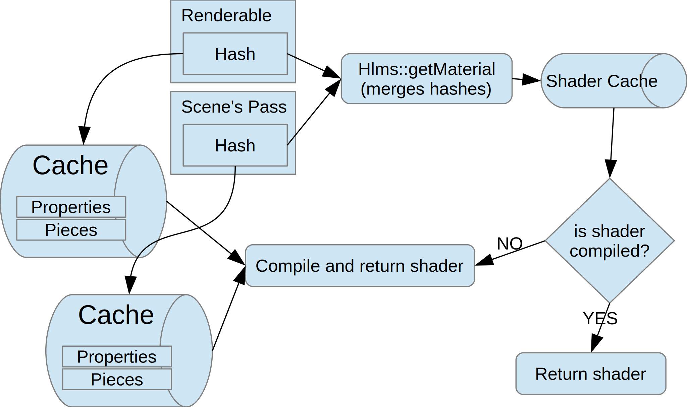
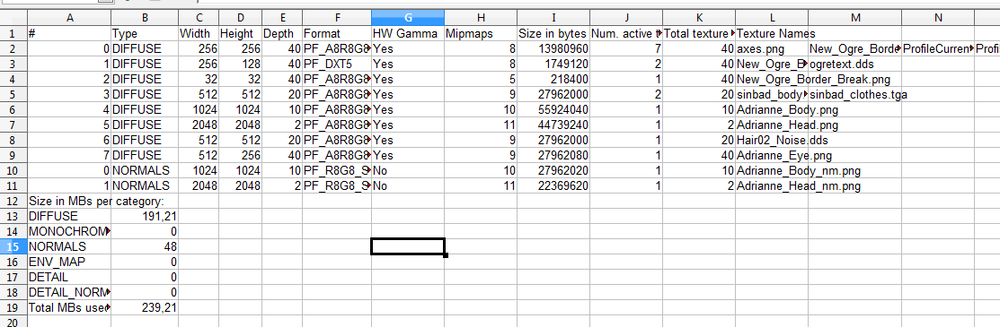
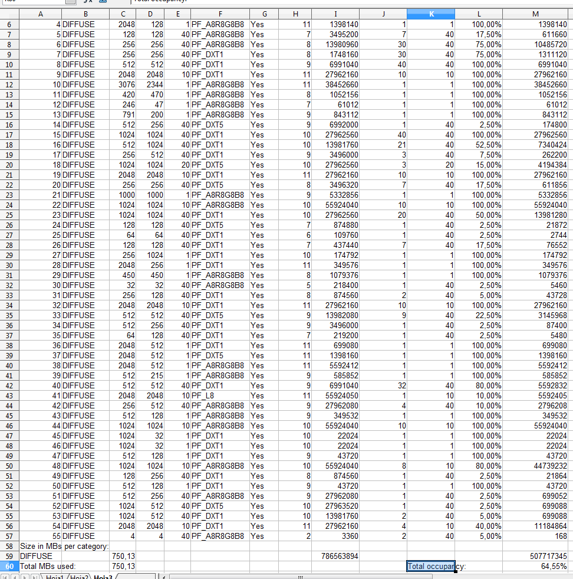

HLMS: High Level Material System {#hlms}
================================

The HLMS (often stylized Hlms) is the new material system used in Ogre
2.0. It's more user friendly and performs faster.

HLMS stands for "High Level Material System", because for the user, the
HLMS means just define the material and start looking at it (no need for
coding or shader knowledge!). But on retrospective, tweaking the shader
code for an HLMS is much low level than the old Materials have ever been
(and that makes them very powerful).

@tableofcontents

# Fundamental changes {#HlmsChanges}

## Viewports and Scissor tests {#HlmsChangesViewports}

Viewports now contain information about the scissor rectangle. Back in
Ogre 1.x; Direct3D 9's support for scissor testing was optional, which
caused lots of headaches. As a result, users could only use low-level
function `RenderSystem::setScissorTest` for manually manipulating the
scissor rect.

In OpenGL, it was even messier because setting and enabling the scissor
rect was needed to perform buffer clears on partial regions of the
framebuffer; which could override user's manual input, potentially
breaking applications that worked fine using Direct3D.

Fortunately, all targetted APIs by Ogre 2.0 support scissor tests, and
thus it is now properly supported. As a result:

-   Viewports hold the information about the scissor rectangle (see
    `Viewport::setScissors`)
-   Enabling and disabling scissor testing is controlled via
    Macroblocks.
-   `RenderSystem::setScissorTest` was removed.
-   `RSC_SCISSOR_TEST` flag was removed.

## A lot of data is stored in "Blocks" {#HlmsChangesBlocks}

Described in detail in the [Blocks section](#9.3.Blocks|outline), many
parameters have been grouped into blocks. Changing depth checks means
changing the whole Macroblock.

You could be thinking the reason I came up with these two is to fit with
D3D11′s grand scheme of things while being compatible with OpenGL. But
that's a half truth and an awesome side effect. I've been developing the
Hlms using OpenGL this whole time.

An OpenGL fan will tell you that grouping these together in single call
like D3D11 did barely reduces API overhead in practice (as long as you
keep sorting by state), and they're right about that.

However, there are big advantages for using blocks:

1.  Many materials in practice share the same Macro- & Blendblock
    parameters. In an age where we want many 3D primitives with the same
    shader but slightly different parameters like texture, colour, or
    roughness (which equals, a different material) having these settings
    repeated per material wastes a lot of memory space… and a lot of
    bandwidth (and wastes cache space). Ogre 2.0 is bandwidth bound, so
    having all materials share the same pointer to the same Macroblock
    can potentially save a lot of bandwidth, and be friendlier to the
    cache at the same time.This stays true whether we use D3D11, D3D12,
    OpenGL, GL ES 2, or Mantle.
2.  Sorting by Macroblock is a lot easier (and faster) than sorting by
    its individual parameters: when preparing the hash used for sorting,
    it's much easier to just do (every frame, per object) `hash
    |= (macroblock->getId() << bits) & mask` than to do: `hash =| m->depth_check | m->depthWrite << 1 | m->depthBias << 2 | m->depth_slope_bias << 3 | m->cullMode << 18 | ... ;` We also need a lot more bits we can't afford. Ogre
    2.0 imposes a limit on the amount of live Macroblocks you can have
    at the same time; as we run out of hashing space (by the way, D3D11
    has its own limit). It operates around the idea that most setting
    combinations won't be used in practice.

Of course it's not perfect, it can't fit every use case. We inherit the
same problems D3D11 has. If a particular rendering technique relies on
regularly changing a property that lives in a Macroblock (i.e. like
alternating depth comparison function between less & greater with every
draw call, or gradually incrementing the depth bias on each draw call);
you'll end up redundantly changing a lot of other states (culling mode,
polygon mode, depth check & write flags, depth bias) alongside it. This
is rare. We're aiming the general use case.

These problems make me wonder if D3D11 made the right choice of using
blocks from an API perspective, since I'm not used to driver
development. However from an engine perspective, blocks make sense.

## Materials are still alive {#HlmsChangesMaterialsAlive}

Let me get this straight: You should be using the HLMS. The usual
"Materials" are slow. Very slow. They're inefficient and not suitable
for rendering most of your models.

However, materials are still useful for:

-   Quick iteration. You need to write a shader, just define the
    material and start coding. Why would you deal with the template's
    syntax or a C++ module when you can just write a script and start
    coding? The HLMS though comes with a Command line tool to know how
    your template translates into a final shader (which is very handy
    for iteration, it's fast, and will check for syntax errors!), but
    it's most useful when you want to write your own C++ module or
    change the template, not when you want to just experiment. Besides,
    old timers are used to writing materials.
-   Postprocessing effects. Materials are much better suited for this.
    Materials are data driven, easy to write. Postprocessing FXs don't
    need an awful lot of permutations (i.e. having to deal with shadow
    mapping, instancing, skeleton animation, facial animation). And
    they're at no performance disadvantage compared to HLMS: Each FX is
    a fullscreen pass that needs different shaders, different textures,
    its own uniforms. Basically, API overhead we can't optimize. But it
    doesn't matter much either, because it's not like there are 100
    fullscreen passes. Usually there's less than 10.

Under the hood there is an HLMS C++ implementation (`HLMS_LOW_LEVEL`)
that acts just as a proxy to the material. The HLMS is an integral part
of Ogre 2.0, not just a fancy add-in.

Materials have been refactored, and thus your old code may need a few
changes. Most notably Macroblocks & Blendblocks have been added to
Materials, thus functions like `Pass::setDepthCheck` & Co have been
replaced by a two calls: `Pass::setMacroblock` & `Pass::setBlendblock`.

## Fixed Function has been removed {#HlmsChangesFFP}

With FFP being removed, multitexturing and pass splitting functionality
was cut as well. The HLMS default systems handle these.

# The three components {#HlmsComponents}

1.  **Scripts.** To set the material properties (i.e. type of Hlms to
    use: PBS, Toon shading, GUI; what textures, diffuse colour,
    roughness, etc). You can also do this from C++ obviously. Everybody
    will be using this part.
2.  **Shader template.** The Hlms takes a couple hand-written glsl/hlsl
    files as template and then adapts it to fit the needs on the fly
    (i.e. if the mesh doesn't contain skeleton, the bit of code
    pertaining to skeletal animation is stripped from the vertex
    shader). The Hlms provides a simple preprocessor to deal with this
    entirely within from the template, but you're not forced to use it.
    Here's a simple example of the preprocessor. I won't be explaining
    the main keywords today. Advanced users will probably want to modify
    these files (or write some of their own) to fit their custom needs.
3.  **C++ classes implementation.** The C++ takes care of picking the
    shader templates and manipulating them before compiling; and most
    importantly it feeds the shaders with uniform/constans data and sets
    the textures that are being in use. It is extremely flexible,
    powerful, efficient and scalable, but it's harder to use than good
    ol' Materials because those used to be data-driven: there are no
    `AutoParamsSource` here. Want the view matrix? You better grab it from
    the camera when the scene pass is about to start, and then pass it
    yourself to the shader. This is very powerful, because in D3D11/GL3+
    you can just set the uniform buffer with the view matrix just once
    for the entire frame, and thus have multiple uniforms buffers sorted
    by update frequency. Very advanced user will be using messing with
    this part.

Based on your skillset and needs, you can pick up to which parts you
want to mess with. Most users will just use the scripts to define
materials, advanced users will change the template, and very advanced
users who need something entirely different will change all three.

For example the PBS (Physically Based Shading) type has its own C++
implementation and its own set of shader templates. The Toon Shading has
its own C++ implementation and set of shaders. There is also an "Unlit"
implementation, specifically meant to deal with GUI and simple particle
FXs (ignores normals & lighting, manages multiple UVs, can mix multiple
texture with photoshop-like blend modes, can animate the UVs, etc)

It is theoretically possible to implement both Toon & PBS in the same
C++ module, but that would be crazy, hard to maintain and not very
modular.


# Blocks {#HlmsBlocks}

We're introducing the concept of blocks, most of them are immutable.
Being immutable means you can't change the Macro- Blend- & Samplerblocks
after being created. If you want to make a change, you have to create a
new block and assign the new one. The previous one won't be destroyed
until asked explicitly.

Technically on OpenGL render systems (GL3+, GLES2) you could `const_cast`
the pointers, change the block's parameters (mind you, the pointer is
shared by other datablocks, so you will be changing them as well as side
effect) and it would probably work. But it will definitely fail on D3D11
render system.

## Datablocks {#HlmsBlocksDatablocks}

A Datablock is a "material" from the user's perspective. It is the only
mutable block. It holds data (i.e. material properties) that will be
passed directly to the shaders, and also holds which Macroblock,
Blendblocks and Samplerblocks are assigned to it.

Most Hlms implementations will create a derived class for Datablocks to
hold their data. For example, `HlmsPbs` creates a datablock called
`HlmsPbsDatablock`. This datablock contains roughness and fresnel
values, which do not make any sense in (e.g.) a GUI implementation.

## Macroblocks {#HlmsBlocksMacroblocks}

Named like that because most entities end up using the macroblock.
Except for transparents, we sort by macroblock first. These contain
information like depth check & depth write, culling mode, polygon mode
(point, wireframe, solid). They're quite analogous to
`D3D11_RASTERIZER_DESC`. And not without reason: under the hood
Macroblocks hold a ID3D11RasterizerState, and thanks to render queue's
sorting, we change them as little as possible. In other words, reduce
API overhead. On GL backends, we just change the individual states on
each block change. Macroblocks can be shared by many Datablocks.

Even in OpenGL, there are performance benefits, because there are
enumeration translations (i.e. `CMPF_LESS -> GL_LESS`) that are
performed and cached when the macroblock gets created, instead of doing
it every time the setting changes.

## Blendblocks {#HlmsBlocksBlendblocks}

Blendblocks are like Macroblocks, but they hold alpha blending operation
information (blend factors: One, One\_Minus\_Src\_Alpha; blending modes:
add, substract, min, max. etc). They're analogous to D3D11\_BLEND\_DESC.
We also sort by blendblocks to reduce state changes.

## Samplerblocks {#HlmsBlocksSampleblocks}

Samplerblocks hold information about texture units, like filtering
options, addressing modes (wrap, clamp, etc), Lod bias, anisotropy,
border colour, etc. They're analogous to `D3D11_SAMPLER_DESC`.

GL3+ and D3D11 both support samplerblocks natively[^12]. On GLES2, the
functionality is emulated (still performance has improved since we can
cache the samplerblock's GL value translations and whether a texture has
already set to a given samplerblock's paremeters).


The diagram shows a typical layout of a datablock. Note that
Samplerblocks do not live inside base HlmsDatablock, but rather in its
derived implementation. This is because some implementations may not
need textures at all, and the number of samplerblocks is unknown. Some
implementations may want one samplerblock per texture, whereas others
may just need one.

Macroblocks and Blendblocks on the other hand, we just need one per
material.

# Hlms templates {#HlmsTemplates}

The Hlms will parse the template files from the template folder
according to the following rules:

1.  The files with the names "VertexShader\_vs", "PixelShader\_ps",
    "GeometryShader\_gs", "HullShader\_hs", "DomainShader\_ds" will be
    fully parsed and compiled into the shader. If an implementation only
    provides "VertexShader\_vs.glsl", "PixelShader\_ps.glsl"; only the
    vertex and pixel shaders for OpenGL will be created. There will be
    no geometry or tesellation shaders.
2.  The files that contain the string "piece\_vs" in their filenames
    will be parsed only for collecting pieces (more on *pieces* later).
    Likewise the words "piece\_ps", "piece\_gs", "piece\_hs",
    "piece\_ds" correspond to the pieces for their respective shader
    stages. Note that you can concatenate, thus
    "MyUtilities\_piece\_vs\_piece\_ps.glsl" will be collected both in
    the vertex and pixel shader stages. You can use "piece\_all" as a
    shortcut to collect from a piece file in all stages.

The Hlms takes a template file (i.e. a file written in GLSL or HLSL) and
spits out valid shader code. Templates can take advantage of the Hlms'
preprocessor, which is a simple yet powerful macro-like preprocessor
that helps writing the required code.

# The Hlms preprocessor {#HlmsPreprocessor}

The preprocessor was written with speed and simplicity in mind. It does
not implement an AST or anything fancy. This is very important to
account while writing templates because there will be cases when using
the preprocessor may feel counter-intuitive or frustrating.

For example
```cpp
  \@property( IncludeLighting )

  /* code here */

  @end
```

is analogous to
```cpp
  #if IncludeLighting != 0

  /* code here */

  #endif
```

However you can't evaluate `IncludeLighting` to anything other than zero
and non-zero, i.e. you can't check whether `IncludeLighting == 2` with the
Hlms preprocessor. A simple workaround is to define, from C++, the
variable "IncludeLightingEquals2" and check whether it's non-zero.
Another solution is to use the GLSL/HLSL preprocessor itself instead of
Hlms'. However the advantage of Hlms is that you can see its generated
output in a file for inspection, whereas you can't see the GLSL/HLSL
after the macro preprocessor without vendor-specific tools. Plus, in the
case of GLSL, you'll depend on the driver implementation having a good
macro preprocessor.

## Preprocessor syntax {#HlmsPreprocessorSyntax}

The preprocessor always starts with @ followed by the command, and often
with arguments inside parenthesis. Note that the preprocessor is always
case sensitive. The following keywords are recognized:

-   \@property
-   \@foreach
-   \@counter
-   \@value
-   \@set add sub mul div mod min max
-   \@piece
-   \@insertpiece
-   \@pset padd psub pmul pdiv pmod pmin pmax

### \@property( expression ) {#HlmsPreprocessorSyntaxProperty}

Checks whether the variables in the expression are true, if so, the text
inside the block is printed. Must be finazlied with @end. The expression
is case sensitive. When the variable hasn't been declared, it evaluates
to false.

The logical operands `&& || !` are valid.

Examples:

```cpp
  \@property( hlms_skeleton )

  //Skeleton animation code here

  @end

  \@property( hlms_skeleton && !hlms_normal )

  //Print this code if it has skeleton animation but no normals

  @end

  \@property( hlms_normal || hlms_tangent )

  //Print this code if it has normals or tangents

  @end

  \@property( hlms_normal && (!hlms_skeleton || hlms_tangent) )

  //Print this code if it has normals and either no skeleton or tangents

  @end
```

It is very similar to \#if hlms\_skeleton != 0 \#endif; however there is
no equivalent \#else or \#elif syntax. As a simple workaround you can
do:

```cpp
  \@property( hlms_skeleton )

  //Skeleton animation code here

  @end \@property( !hlms_skeleton )

  //Non-Skeleton code here

  @end
```

Newlines are not necessary. The following is perfectly valid:

```
  diffuse = surfaceDiffuse \@property( hasLights )* lightDiffuse@end ;
```

Which will print:

```
  hasLights != 0                              hasLights == 0
  diffuse = surfaceDiffuse * lightDiffuse;   diffuse = surfaceDiffuse ;
```

### @foreach( count, scopedVar, [start] ) {#HlmsPreprocessorSyntaxForeach}

Loop that prints the text inside the block, The text is repeated `count - start` times. Must be finalized with `@end`.

-   count The number of times to repeat the loop (if start = 0). Count
	can read variables.
-   `scopedVar` is a variable that can be used to print the
    current iteration of the loop while inside the block. i.e.
    `@scopedVar` will be converted into a number in the range \[start;
    count)
-   start Optional. Allows to start from a value different than 0. Start
    can read variables.

Newlines are very important, as they will be printed with the loop.

Examples:
|  Expression    |         Output |
|----------------|----------------|
|  \@foreach( 4, n ) <br>&emsp; \@n\@end  | <br>0<br>1<br>2<br>3|
|  \@foreach( 4, n ) \@n\@end             |   0 1 2 3 |
|  \@foreach( 4, n )<br>&emsp;\@n<br>\@end        |  <br>0<br><br>1<br><br>2<br><br>3<br> |
|  \@foreach( 4, n, 2 ) \@n\@end  |            2 3 |
| \@pset( myStartVar, 1 )<br>\@pset( myCountVar, 3 )<br>\@foreach( myStartVar, n, myCountVar )<br>&emsp;\@n\@end         |          1<br>2 |
|  \@foreach( 2, n )<br>&emsp;\@insertpiece( pieceName\@n )\@end | \@insertpiece( pieceName0 )<br>        \@insertpiece( pieceName1 ) |

>  Attention \#1!
> 
>  Don't use the common letter i for the loop counter. It will conflict with other keywords.
>
>  i.e. `@foreach( 1, i )@insertpiece( pieceName )@end` will print `0nsertpiece( pieceName )` which is probably not what you intended.
>
>  Attention \#2!
> 
>  foreach is parsed after property math (pset, padd, etc). That means that driving each iteration through a combination of properties and padd functions will not work as you would expect.
>
>  i.e. The following code will not work:
>
> ```cpp
>    @pset( myVar, 1 )
>
>    @foreach( 2, n )
>
>    //Code
>
>    @psub( myVar, 1 ) //Decrement myVar on each loop
>
>    \@property( myVar )
>
>    //Code that shouldn't be printed in the last iteration
>
>    @end
>
>    @end
>```
>
>  Because psub will be evaluated before expanding the foreach.

### @counter( variable ) {#HlmsPreprocessorSyntaxCounter}

Prints the current value of variable and increments it by 1. If the
variable hasn't been declared yet, it is initialized to 0.

Examples:

```
  Expression          Output

  @counter( myVar )   0
                      
  @counter( myVar )   1
                      
  @counter( myVar )   2
```

### @value( variable ) {#HlmsPreprocessorSyntaxValue}

Printes the current value of variable without incrementing it. If the
variable hasn't been declared, prints 0.

```cpp
  Expression          Output

  @value( myVar )     0
                      
  @value( myVar )     0
                      
  @counter( myVar )   0
                      
  @value( myVar )     1
                      
  @value( myVar )     1
```

### @set add sub mul div mod min max {#HlmsPreprocessorSyntaxSetEtc}

Sets a variable to a given value, adds, subtracts, multiplies, divides,
calculates modulus, or the minimum/maximum of a variable and a constant,
or two variables. This family of functions get evaluated after
foreach(s) have been expanded and pieces have been inserted. Doesn't
print its value.

Arguments can be in the form `@add(a, b)` meaning a += b; or in the form
`@add( a, b, c )` meaning a = b + c

Useful in combination with `@counter` and `@value`

|  Expression     |        Output |  Math |
|-----------------|---------------|-------|
|  \@set( myVar, 1 ) <br> \@value( myVar ) |       1     |   myVar = 1 |                              
|  \@add( myVar, 5 )<br> \@value( myVar )   |    6  |      myVar = 1 + 5|
|  \@div( myVar, 2 ) <br> \@value( myVar ) |     3   |     myVar = 6 / 2|
|  \@mul( myVar, myVar )<br> \@value( myVar ) |  9   |     myVar = 3 * 3|
|  \@mod( myVar, 5 ) <br> \@value( myVar )    |  4   |     myVar = 9 % 5|
|  \@add( myVar, 1, 1 ) <br> \@value( myVar ) |  2  |       myVar = 1 + 1|

### @piece( nameOfPiece ) {#HlmsPreprocessorSyntaxPiece}

Saves all the text inside the blocks and saves it as a named piece. If a
piece with the given name already exists, a compiler error will be
thrown. The text that was inside the block won't be printed. Useful when
in combination with `@insertpiece`. Pieces can also be defined from C++ or
[collected](#9.3.Hlms templates|outline) from piece template files.

Trying to define a piece twice will result in error and may produce
incorrect output.

Example:

```cpp
  Expression                        Output

  @piece( VertexTransform )         
                                    
  outPos = worldViewProj * inPos   
                                    
  @end
```

### @insertpiece( nameOfPiece ) {#HlmsPreprocessorSyntaxInsertpiece}

Prints a block of text that was previously saved with piece (or from
C++). If no piece with such name exists, prints nothing.

Example:

```
  Expression                                                     Output

  @piece( VertexTransform )outPos = worldViewProj * inPos@end   void main()
                                                                 
  void main()                                                    {
                                                                 
  {                                                              outPos = worldViewProj * inPos
                                                                 
  @insertpiece( VertexTransform )                                }
                                                                 
  @insertpiece( InexistentPiece )                                
                                                                 
  }
```

### @undefpiece( nameOfPiece ) {#HlmsPreprocessorSyntaxUndefpiece}

Undefines an existing piece, probably so you can override it with
customizations. Note: undefpiece is parsed per file, before pieces from
that file are collected, and its effects are global wide. It's only
useful for undefining pieces defined in previous files.

If the piece is not defined, no error or warning is given. Parsing
continues normally.

Example:

<table>
<tr>
<th>Original_piece_vs.glsl</th>
<th>Overrider_piece_vs.glsl</th>
</tr>
<tr>
<td>
```cpp
@piece( Hello )//Hello World@end

@piece( VertexOut )@insertpiece( Hello )
outPos = vec4( 1.0, 1.0, 1.0, 1.0 );
@end
```
</td>
<td>
```cpp
@undefpiece( Hello )
@piece( Hello )//Overriden@end
```
</td>
</tr>
</table>

<table>
<tr>
<th>VertexShader_vs.glsl</th>
<th>Output</th>
</tr>
<tr>
<td>
```cpp
void main()
{
	@insertpiece( VertexOut )
}
```
</td>
<td>
```cpp
void main()
{
	//Overriden
	outPos = vec4( 1.0, 1.0, 1.0, 1.0 );
}
```
</td>
</tr>
</table>


Note that despite we already had `Hello` inserted inside `VertexOut`;
and that we only overrode `Hello` (not `VertexOut`) and yet the final
output showed the overriden `Hello` version.

### @pset padd psub pmul pdiv pmod pmin pmax {#HlmsPreprocessorSyntaxPsetEtc}

Analogous to [the family of math functions without the 'p'
prefix](#9.4.1.5.@set add sub mul div mod|outline). The difference is
that the math is evaluated before anything else. There is no much use to
these functions, probably except for quickly testing whether a given
flag/variable is being properly set from C++ without having to
recompile.

i.e. If you suspect `hlms_normal` is never being set, try `@pset(
hlms_normal, 1 )`

One important use worth mentioning, is that variables retain their
values across shader stages. First the vertex shader template is parsed,
then the pixel shader one. If 'myVal' is 0 and the vertex shader
contains @counter( myVal ); when the pixel shader is parsed @value(
myVal ) will return 1, not 0.

If you need to reset these variables across shader stages, you can use
pset( myVal, 0 ); which is guaranteed to reset your variable to 0 before
anything else happens; even if the pset is stored in a piece file.

# Creation of shaders {#HlmsCreationOfShaders}

There are two components that needs to be evaluated that may affect the
shader itself and would need to be recompiled:

1.  The Datablock/Material. Does it have Normal maps? Then include code
    to sample the normal map and affect the lighting calculations. Does
    it have a diffuse map? If not, avoid sampling the diffuse map and
    multiplying it against the diffuse colour, etc.
2.  The Mesh. Is it skeletally animated? Then include skeletal animation
    code. How many blend weights? Modify the skeletal animation code
    appropiately. It doesn't have tangents? Then skip the normal map
    defined in the material. And so on.

When calling `Renderable::setDatablock()`, what happens is that
`Hlms::calculateHashFor` will get called and this function evaluates
both the mesh and datablock compatibility. If they're incompatible (i.e.
the Datablock or the Hlms implementation requires the mesh to have
certain feature. e.g. the Datablock needs 2 UV sets bu the mesh only has
one set of UVs) it throws.

If they're compatible, all the variables (aka properties) and pieces are
generated and cached in a structure (mRenderableCache) with a hash key
to this cache entry. If a different pair of datablock-mesh ends up
having the same properties and pieces, they will get the same hash (and
share the same shader).

The following graph summarizes the process:


Later on during rendering, at the start each render pass, a similar
process is done, which ends up generating a [pass
hash](#9.6.1.preparePassHash|outline) instead of a renderable hash.
Pass data stores settings like number of shadow casting lights, number
of lights per type (directional, point, spot).

While iterating each renderable for render, the hash key is read from
the Renderable and merged with the pass' hash. With the merged hash, the
shader is retrieved from a cache. If it's not in the cache, the shader
will be generated and compiled by merging the cached data (pieces and
variables) from the Renderable and the Pass. The following graph
illustrates the process:



## C++ interaction with shader templates {#HlmsCreationOfShadersCpp}

Note: This section is relevant to those seeking to write their own Hlms
implementation.

C++ can use `Hlms::setProperty( "key", value )` to set "key" to the given
value. This value can be read by `\@property`, `@foreach`,
`@add/sub/mul/div/mod`, `@counter`, `@value` and `@padd/psub/pmul/pdiv/pmod`

To create pieces (or read them) you need to pass your custom
`Hlms::PiecesMap` to `Hlms::addRenderableCache`.

The recommended place to do this is in `Hlms::calculateHashForPreCreate`
and `Hlms::calculateHashForPreCaster.` Both are virtual. The former gets
called right before adding the set of properties, pieces and hash to the
cache, while the latter happens right before adding the similar set for
the shadow caster pass.

In those two functions you get the chance to call setProperty to set
your own variables and add your own pieces.

Another option is to overload `Hlms::calculateHashFor` which gives you
more control but you'll have to do some of the work the base class does.

For some particularly complex features, the Hlms preprocessor may not be
enough, too difficult, or just impossible to implement, and thus you can
generate the string from C++ and send it as a piece. The template shader
can insert it using @insertpiece.

The function `Hlms::createShaderCacheEntry` is the main responsible for
generating the shaders and parsing the template through the Hlms
preprocessor. If you overload it, you can ignore pieces, properties;
basically override the entire Hlms system and provide the source for the
shaders yourself. See the HlmsLowLevel implementation which overrides
the Hlms entirely and acts as a mere proxy to the old Material system
from Ogre 1.x; the flexibility is really high.

## Common conventions {#HlmsCreationOfShadersConventions}

Properties starting with `hlms_` prefix are common to all or most Hlms
implementations. i.e. `hlms_skeleton` is set to 1 when a skeleton is
present and hardware skinning should be performed.

Save properties' `IdString`s (hashed strings) into constant as performance
optimizations. Ideally the compiler should detect the constant
propagation and this shouldn't be needed, but this often isn't the case.

For mobile, avoid `mat4` and do the math yourself. As for 4x3 matrices
(i.e. skinning), perform the math manually as many GLES2 drivers have
issues compiling valid glsl code.

Properties in `underscore_case` are set from C++; propierties in
`camelCase` are set from the template.

Propierties and pieces starting with `custom_` are for user
customizations of the template

TBD

## Hot reloading {#HlmsCreationOfShadersHotReloading}

Hlms supports modifying the template files externally and reloading
them, taking immediate effect. Call `Hlms::reloadFrom` to achieve this.
How to get notified when the files were changed is up to the user.

## Disabling a stage {#HlmsCreationOfShadersDisablingStage}

By default if a template isn't present, the shader stage won't be
created. e.g. if there is no `GeometryShader_gs.glsl` file, no geometry
shader will be created. However there are times where you want to use a
template but only use this stage in particular scenarios (e.g. toggled
by a material parameter, disable it for shadow mapping, etc.). In this
case, set the property `hlms_disable_stage` to non-zero from within the
template (i.e. using @set) . The value of this property is reset to 0
for every stage.

Note that even when disabled, the Hlms template will be fully parsed and
dumped to disk; and any modification you perform to the Hlms properties
will be carried over to the next stages. Setting `hlms_disable_stage` is
not an early out or an abort.

## Customizing an existing implementation {#HlmsCreationOfShadersCustomizing}

In many cases, users may want to slightly customize the shaders to
achieve a particular look, implement a specific feature, or solve a
unique problem; without having to rewrite the whole implementation.

Maximum flexibility can be get by directly modifying the original source
code. However this isn't modular, making it difficult to merge when the
original source code has changed. Most of of the customizations don't
require such intrusive approach.

**Note:** For performance reasons, the listener interface does not allow
you to add customizations that work per Renderable, as that loop is
performance sensitive. The only listener callback that works inside
`Hlms::fillBuffersFor` is hlmsTypeChanged which only gets evaluated when
the previous Renderable used a different Hlms implementation; which is
rare, and since we sort the RenderQueue, it often branch predicts well.

There are different levels in which an Hlms implementation can be
customized:

1.  Using a library, see [Hlms
    Initialization](#8.8.1.Initialization|outline). pass a set of piece
    files in a folder by pushing the folder to `ArchiveVec`. The files in
    that folder will be parsed first, in order (`archiveVec[0]` then
    `archiveVec[1]`, ... `archiveVec[N-1]`); which will let you define
    your own pieces to insert code into the default template (see the
    the table at the end). You can also do clever tricky things to avoid
    dealing with C++ code at all even if there are no `custom_` pieces
    for it. For example, you can write the following code to override
    the BRDF declarations and provide a custom BRDF:

```cpp
  //Disable all known BRDFs that the implementation may enable
  
  @pset( BRDF\_CookTorrance, 0 )
  
  @pset( BRDF\_Default, 0 )
  
  @piece( DeclareBRDF )
  
   // Your BRDF code declaration here
  
  @end
```

1.  Via listener, through `HlmsListener`. This allows you to have access
    to the buffer pass to fill extra information; or bind extra buffers
    to the shader.
2.  Overload `HlmsPbs`. Useful for overriding only specific parts, or
    adding new functionality that requires storing extra information in
    a datablock (e.g. overload HlmsPbsDatablock to add more variables,
    and then overload `HlmsPbs::createDatablockImpl` to create these
    custom datablocks)
3.  Directly modify `HlmsPbs`, `HlmsPbsDatablock` and the template.

| Variable | Description |
|----------|-------------|
| custom_passBuffer            |   Piece where users can add extra information for the pass buffer (only useful if the user is using HlmsListener or overloaded HlmsPbs. |
| custom_VStoPS                |   Piece where users can add more interpolants for passing data from the vertex to the pixel shader.|
| custom_vs_attributes         |  Custom vertex shader attributes in the Vertex Shader (i.e. a special texcoord, etc).|
| custom_vs_uniformDeclaration |  Data declaration (textures, texture buffers, uniform buffers) in the Vertex Shader.|
| custom_vs_preExecution       |  Executed before Ogre's code from the Vertex Shader.|
| custom_vs_posExecution       |  Executed after all code from the Vertex Shader has been performed.                     |
| custom_ps_uniformDeclaration |  Same as custom_vs_uniformDeclaration, but for the Pixel Shader|
| custom_ps_preExecution       |  Executed before Ogre's code from the Pixel Shader.|
| custom_ps_posMaterialLoad    |  Executed right after loading material data; and before anything else. May not get executed if there is no relevant material data (i.e. doesn't have normals or QTangents for lighting calculation)|
| custom_ps_preLights          |  Executed right before any light (i.e. to perform your own ambient / global illumination pass). All relevant texture data should be loaded by now.|
| custom_ps_posExecution       |  Executed after all code from the Pixel Shader has been performed.|
| custom_ps_uv_modifier_macros |  PBS specific. Allows you to override the macros defined in Samples/Media/Hlms/Pbs/Any/UvModifierMacros_piece_ps.any so you can apply custom transformations to each UV. e.g. `#undef UV_DIFFUSE #define UV_DIFFUSE( x ) ((x) * 2.0)` |
| custom_ps_functions          | Used to declare functions outside the main body of the shader |

# Run-time rendering {#HlmsRuntimeRendering}

## preparePassHash {#HlmsRuntimeRenderingPreparePassHash}

This function gets called once per `render_scene` pass (note there can be
multiple `render_scene` passes per frame) even if no Renderable actually
uses your Hlms implementation.

In this function you can read the scene state and bake all the necessary
data that will be shared for all the objects, like forward lights,
shadow mapped lights, view and projection matrices, depth ranges, etc.

The function returns a cache + hash specific for the pass that will be
merged with the Renderable's hash and the result will be used to compile
the shader to be used.

## fillBuffersFor {#HlmsRuntimeRenderingFillBuffersFor}

This function gets executed for every Renderable that is going to be
rendered. Implementations are meant to read the Renderable's data and
fill their GPU data structures, like world matrix, bone matrices (if
skeletally animated), set the textures. They can rely on parameters like
`lastCache` and `lastTextureHash` to obtain information about the
previously rendered object and avoid setting again many shared
paremeters.

# Using the HLMS implementations {#UsingHlmsImplementation}

## Initialization {#UsingHlmsImplementationInitialization}

Before parsing the resources, i.e. before
`ResourceGroupManager::initialiseAllResourceGroups` is called, you need to
setup the proper Hlms.

Ogre is shipped with four implementations:

-   PBS: Stands for Physically Based Shading. The most common for most
    of your material needs.
-   Unlit: Basic system with no lighting or skeleton skinning. Great for
    GUI, billboards, particle FXs. Supports multiple texture layering
    with photoshop-like blending modes.
-   PBS Mobile: Same as PBS, but written for GLES2 (i.e. old Android and
    iOS devices, WebGL)
-   Unlit Mobile: Sames as Unlit, but written for GLES2.

First need to create each implementation, specifying the location of the
shader templates.

```cpp
Archive *archiveLibrary = Ogre::ArchiveManager::getSingletonPtr()->load(
                "/home/myuser/OgreSDK/Samples/Media/Hlms/Common/GLSL",
                "FileSystem", true );
ArchiveVec library;
library.push_back( archiveLibrary );

Archive *archivePbs = ArchiveManager::getSingletonPtr()->load(
                "/home/myuser/OgreSDK/Samples/Media/Hlms/Pbs/GLSL",
                "FileSystem", true );
HlmsPbs *hlmsPbs = OGRE_NEW HlmsPbs( archivePbs, &library );
```

Notice that 'Archive' is a well known file system interface. Advanced
users could use their own filesystem implementations and store template
shaders in custom packed file formats (i.e. encrypted zip files).

Immediately afterwards, you will need to register the Hlms:

```cpp
Root::getSingleton().getHlmsManager()->registerHlms( hlmsPbs );
```

And that's it.

## Deinitialization {#UsingHlmsImplementationDeinitilization}

The function registerHlms accepts a boolean parameter named
`deleteOnExit` which is true by default.

When true, Ogre will automatically call `OGRE_DELETE hlmsPbs` on
shutdown (when unregisterHlms gets called) and most of the time you
don't need to worry.

If you set this parameter to false, you will have to free the memory
yourself after calling unregisterHlms. No renderable should be using any
datablock created by that Hlms once it is destroyed; otherwise you will
leave dangling pointers. On debug mode, Ogre will assert if it detects a
Renderable using a datablock that is being destroyed.

Reasons for setting the parameter to false could include: the Hlms
implementation lives in a different DLL and cannot be freed from
OgreMain.dll; the Hlms implementation was allocated with a different
allocator; you want to keep the Hlms alive even after unregistering, you
like to do stuff manually, etc.

## Creating a datablock {#UsingHlmsImplementationCreatingDatablock}

To create your own datablocks, you can use the following snippet, which
will create a new datablock with default macroblock and blendblock
parameters:

```cpp
bool visibleToManager = true;
HlmsPbsDatablock *datablock = reinterpret_cast<HlmsPbsDatablock*>(
            hlmsPbs->createDatablock( "myRealName", "myHumanReadableName",
                          HlmsMacroblock(), HlmsBlendblock(),
                          HlmsParamVec(), visibleToManager ) );
```

The last parameter, `visibleToManager`, specifies whether the
HlmsManager will see this Hlms when asking for its name.

For example, both PBS and Unlit implementations may have a material
named "Green". However only one can be visible to the manager; let's
assume that the PBS one was made visible.

When you call `Renderable::setDatablock( "Green" )`, the HlmsManager will
look the one that is visible to it. To assign the Unlit version of
"Green" instead of the PBS one, you will have call the overload that
specifies the pointer, and grab the datablock from the implementation
itself: `Renderable::setDatablock( hlmsUnlit->getDatablock( "Green" ) )`;

The function createDatablock allows two names: the hashed string and the
human readable one. Most of the time you want them to be the same, but
this isn't enforced. Note that the human readable name doesn't affect
the functionality in any way. Its only purpose is to allow material
editors and other GUIs based on Ogre to display the material's name;
since IdString destroys the original string in Release mode.

HlmsParamVec is an array/vector of key-value string pairs to specify
custom parameters on creation. Valid values depends on the
implementation. You should see the Constructor's documentation for more
information on them.

# The Hlms Texture Manager {#HlmsTextureManager}

Most of the time optional, the Hlms uses its own texture manager to
improve rendering performance.

Its main function is to pack texture together to reduce the amount of
API overhead during rendering. The Hlms Texture Manager runs *on top* of
the original TextureManager and is *not* meant to replace it.

On desktop, it will pack texture together using texture arrays. On
mobile, it will use UV atlas instead. Ideally we would use bindless
textures on desktop, however lack of D3D11 API (and D3D10 hardware)
support for this feature makes this task very difficult.

## Automatic batching {#HlmsTextureManagerAutomaticBatching}

By default, the manager will batch together all textures as they keep
getting loaded.

The function `HlmsTextureManager::createOrRetrieveTexture` will first see
if the texture has already been loaded. If it has, it will return the
texture array or uv atlas; enclosed in the following structure:

```cpp
struct TextureLocation
{
    TexturePtr  texture;
    uint16      xIdx;
    uint16      yIdx;
    uint16      divisor;
};
```

The texture pointer is the actual atlas/array texture.

On Desktop, only xIdx is used, which indicates which slice in the array
contains our texture.

In order to sample in the pixel shader, one needs to perform:

```cpp
// GLSL
vec4 colour = texture( myArrayTex, vec3( uv.xy, float(xIdx) ) );
// HLSL
float4 colour myArrayTex.Sample( mySampler, float3( uv.xy, float(xIdx) ) );
```

On Mobile, xIdx indicates the horizontal offset of the UV needed to
sample the texture, and yIdx the vertical offset. Both values have to be
divided by divisor in order to be in the usual \[0; 1\] range of UVs.

For example, suppose four 512x512 are packed together into a 1024x1024
texture:

  A (512x512) | B (512x512)
  ------------|-------------
  B (512x512) | C (512x512)
  
If you ask for texture "B", then xIdx = 1, yIdx = 0, divisor = 2. In
order to sample in the pixel shader we will need to do:

```cpp
vec4 colour = texture2D( myTex, (uv.xy + vec2( xIdx, yIdx )) / divisor );
```

**Only textures of the same format and resolution will be packed
together, both in Desktop and Mobile**. The Manager will automatically
convert all RGB/BGR/ARGB/RGBA/BGRA/etc variants as ARGB (or ABGR
depending on the platform's default) to avoid unnecessary limitations on
the texture combinations that can be packed together.

When the texture is being loaded for the first time, the manager will
try to insert it into the first available array/atlas it sees, or else
create a new one. Several parameters affect the creation of the texture
array/atlas, which can be configured in

```cpp
DefaultTextureParameters mDefaultTextureParameters[NUM_TEXTURE_TYPES];
```

>  Attention \#1!
>
>  Automatic batching works 'on the fly'. You should load related textures together to prevent completely unrelated textures getting packed in the same array/atlas while the related ones end up in different arrays/atlas.
>
>  Since the ResourceManager parses folders in order, you should store all hlms material definitions classified by folders so that they get loaded closely and increase the chance of packing everything that is related together.

### Texture types {#HlmsTextureManagerAutomaticBatchingTextureTypes}

The texture types are like "profiles" of batching/packing
configurations, and only apply for textures being loaded for the first
time. **The texture type is ignored when such texture has already been
loaded, and beware that it may have been packed with different
settings**. If you need to load it with different parameters, see
[aliasing](#8.9.1.4.Loading a texture twice (i.e. with a different format) via aliasing|outline).

The following types are defined:

-   TEXTURE\_TYPE\_DIFFUSE
-   TEXTURE\_TYPE\_MONOCHROME
-   TEXTURE\_TYPE\_NORMALS
-   TEXTURE\_TYPE\_ENV\_MAP
-   TEXTURE\_TYPE\_DETAIL
-   TEXTURE\_TYPE\_DETAIL\_NORMAL\_MAP

The reasons to have multiple profiles are simple:

1.  Some textures, i.e. normal maps, require to be transformed to a
    special format, like BC5 or UV88 (two-component normalized signed
    8-bit format). The Manager will convert the texture to those formats
    before packing.
2.  Roughness textures are usually monochrome and users may want to
    ensure that they get loaded with the optimal pixel format for them
    (i.e. `PF_L8`) even if the original is stored as a 32-bit RGBA PNG
    file. Furthermore, sRGB (gamma correction) is disabled for these
    textures.
3.  Detail maps & its normal maps are usually meant to be tileable.
    Therefore on mobile, UV atlas is disabled.

Desktop-only Hlms implementations already skip the use of
`TEXTURE_TYPE_DETAIL` & `TEXTURE_TYPE_DETAIL_NORMAL_MAP` enumerations
since they're only useful in Mobile; and use `TEXTURE_TYPE_DIFFUSE` and
`TEXTURE_TYPE_NORMALS` instead.

### Automatic parameters {#HlmsTextureManagerAutomaticBatchingAutoParams}

The packing algorithm uses multiple criteria to determine whether it
should pack or not a texture:

```cpp
/// Textures whose size are less or equal to minTextureSize
/// (without considering mipmaps) will have their maxTexturesPerArray
/// clamped to the value given in this threshold structure
struct Threshold
{
    uint32      minTextureSize;
    uint32      maxTexturesPerArray;
};
typedef vector<Threshold>::type ThresholdVec;
struct DefaultTextureParameters
{
    /// Unknown means assign based on the individual texture
    PixelFormat pixelFormat;
    uint16      maxTexturesPerArray;
    bool        mipmaps;
    bool        hwGammaCorrection;
    PackingMethod packingMethod;
    bool        isNormalMap;
    /// Whether non-power-of-2 textures should be packed together.
    bool        packNonPow2;
    /// Textures with a higher AR (whether width / height or height / width)
    /// than this value won't be packed.
    /// Example: packMaxRatio = 2; textures with a resolution of 1024x512 or
    /// 512x2048 won't be packed because 1024 / 512 >= 2 and 2048 / 512 >= 2
    float       packMaxRatio;
    /// Only used when packingMethod == TextureArrays
    ThresholdVec    textureArraysTresholds;
};
```

The comments and the code itself should be self-explanatory. The setting
`pixelFormat` allows to force a conversion to a particular format. When
left as `PF_UNKNOWN`, the texture's original format will be used (except
for RGB/BGR/ARGB/BGRA/etc variations).

The setting `maxTexturesPerArray` controls the maximum number of textures
that can be packed together. Note the actual number may be lower either
due to hardware limitations (i.e. you can't make an uv atlas with 16
512x512 textures on a GPU that has a maximum texture resolution of
1024x1024) or due to the `textureArraysTresholds` parameter (which only
applies on Desktop).

The parameters `packNonPow2` and `packMaxRatio` operate under the assumption
that such textures are rare and therefore should not be packed to
prevent memory waste.

The setting isNormalMap should only be used for normal mapping: the
manager will automatically convert unsigned formats \[0; 1\] to signed
formats \[-1; 1\] except for the Z component (Blue channel).

### Loading a texture twice (i.e. with a different format) via aliasing {#HlmsTextureManagerAutomaticBatchingLoadingTwice}

There are cases where you want to load textures with different profiles.
For example, you may want to load a normal map as a normal map (signed
format) but at the same time allow viewing its raw contents as if you
were to look at them with an image viewer (unsigned format). This is not
common in-game, but very common within resource editors.

You achieve this via *aliasing*. Aliasing allows you to load the same
texture twice (or more), under two different names; and therefore with
different profiles. This is the definition of `createOrRetrieveTexture`:

```cpp
/// See other overload. This one allows aliasing a texture. If you have
/// "VERY_TECHNICAL_NAME_HASH_1234.png" as texName, you can make your first
/// call with aliasName as "Tree Wood", and the next calls to
/// createOrRetrieveTexture( "Tree Wood", mapType ) will refer to this texture
TextureLocation createOrRetrieveTexture( const String &aliasName,
                                         const String &texName,
                                         TextureMapType mapType );
```

The alias name is an arbitrary name and must be unique. The "texName" is
the actual name of the texture to load. For example, we may want to load
MyNormalMap.dds as a normal map, and as a raw texture:

```cpp
TextureLocation texLoc;
texLoc = createOrRetrieveTexture( "As Normal Map", "MyNormalMap.dds",
                                                  TEXTURE_TYPE_NORMALS );
texLoc = createOrRetrieveTexture( "As Raw Map", "MyNormalMap.dds",
                                  TEXTURE_TYPE_DIFFUSE );
```

Now the texture is loaded twice in the GPU. Set the datablock's texture
to the name "As Raw Map" to view it, and the name "As Normal Map" to use
it as a normal map.

Note that if you try to use the name "MyNormalMap.dds" in the datablock,
you will load the texture again for a 3rd time; as this will create an
alias "MyNormalMap.dds" to the texture "MyNormalMap.dds".

Aliasing is also useful when you've got textures stored on disk with a
very technical name, but address them with a fancy, more user friendly
name.

## Manual: Texture packs {#HlmsTextureManagerTexturePacks}

The user can design their own texture packs. The Manager will never try
to modify them automatically.

The reasons to use texture packs are varied:

-   Guarantee related textures are loaded together in the same array.
-   Improve loading time by baking as much information as possible
    offline.
-   Certain formats can't be batched at runtime for UV atlas (i.e.
    PVRTC2) and thus needs to done offline.

TBD

## Watching out for memory consumption {#HlmsTextureManagerWatchOutMemory}

Incorrectly configuring the Hlms Texture Manager or having a messy Asset
folder can easily cause weird crashes or cause GPU out of memory
exceptions.

For example one single 4096x4096 texture at 32 bpp requires 64MB. A
`maxTexturesPerArray` of 8 means that Ogre will attempt to request 512MB
of consecutive GPU memory. This requires at least a 1GB GPU, and even
then, it may not be possible due to fragmentation, staging resources, or
even CPU-side virtual address exhaustion in 32-bit executables on 32-bit
OSes.

To prevent this particular case, the `textureArraysTresholds` parameter
will kick in; and will clamp `maxTexturesPerArray` to 1.

Nonetheless, special attention needs to be taken to ensure maximum
occupancy of the each array.

The function `HlmsTextureManager::dumpMemoryUsage` is a powerful tool that
will dump all loaded textures to the log in CSV format using '|' as
separator for further analysis on MS Excel or OpenOffice Calc.

The following is an example of the dump's output:

```
  17:40:45: ================================Start dump of HlmsTextureManager================================
  
  17:40:45: |\#|Type|Width|Height|Depth|Format|HW Gamma|Mipmaps|Size in bytes|Num. active textures|Total texture capacity|Texture Names
  
  17:40:45: |0|DIFFUSE|256|256|40|PF\_A8R8G8B8|Yes|8|13980960|7|40|axes.png|New\_Ogre\_Border.png|ProfileCurrentBar.png|ProfileAvgBar.png|ProfileMinBar.png|ProfileMaxBar.png|sinbad\_sword.tga
  
  17:40:45: |1|DIFFUSE|256|128|40|PF\_DXT5|Yes|8|1749120|2|40|New\_Ogre\_Border\_Center.dds|ogretext.dds
  
  17:40:45: |2|DIFFUSE|32|32|40|PF\_A8R8G8B8|Yes|5|218400|1|40|New\_Ogre\_Border\_Break.png
  
  17:40:45: |3|DIFFUSE|512|512|20|PF\_A8R8G8B8|Yes|9|27962000|2|20|sinbad\_body.tga|sinbad\_clothes.tga
  
  17:40:45: |4|DIFFUSE|1024|1024|10|PF\_A8R8G8B8|Yes|10|55924040|1|10|Adrianne\_Body.png
  
  17:40:45: |5|DIFFUSE|2048|2048|2|PF\_A8R8G8B8|Yes|11|44739240|1|2|Adrianne\_Head.png
  
  17:40:45: |6|DIFFUSE|512|512|20|PF\_A8R8G8B8|Yes|9|27962000|1|20|Hair02\_Noise.dds
  
  17:40:45: |7|DIFFUSE|512|256|40|PF\_A8R8G8B8|Yes|9|27962080|1|40|Adrianne\_Eye.png
  
  17:40:45: |0|NORMALS|1024|1024|10|PF\_R8G8\_SNORM|No|10|27962020|1|10|Adrianne\_Body\_nm.png
  
  17:40:45: |1|NORMALS|2048|2048|2|PF\_R8G8\_SNORM|No|11|22369620|1|2|Adrianne\_Head\_nm.png
  
  17:40:45: |Size in MBs per category:
  
  17:40:45: |DIFFUSE|191.21
  
  17:40:45: |MONOCHROME|0
  
  17:40:45: |NORMALS|48
  
  17:40:45: |ENV\_MAP|0
  
  17:40:45: |DETAIL|0
  
  17:40:45: |DETAIL\_NORMAL\_MAP|0
  
  17:40:45: |Total MBs used:|239.21
  
  17:40:45: ================================End dump of HlmsTextureManager================================
```

You should copy the dump, open OpenOffice Calc, and hit paste. It will
open a text import dialog. It's important that you select '|' as
separator:


Once you hit OK, you should see the formatted output:

Now that you have it on spreadsheet, you can add more columns and
perform additional useful statistics:



-   =J2 / K2 will give you the % of occupancy per texture.
-   =I2 / K2 will give you the size of each individual texture (and not
    the whole array)
-   =J2 / K2 \* J2 will give you the size actually being used.
-   The sum of all the texture memory actually being used used divided
    by the total texture memory will give you the total % of occupancy


In this very simple example, we have very few textures
thus heavily underusing the reserved space. We only use 19.69% of the
memory the Hlms Texture Manager actually requested! That's just 47MB out
of the 239MB.

You can also rely on autofilters and sort functionality (sort by biggest
unused space first!) from spreadsheets to narrow down inefficiencies.

From this example we can gather:

-   We have *very* few textures, thus we should change the defaults in
    `DefaultTextureParameters`. Real world applications won't usually have
    this problem though.
-   We have a lot of heterogenous data: Mixed ARGB formats with
    compressed DXT1, lots of different resolutions. We should aim to
    make these homoegenous.

The following is a more real-life example (edited):



We can gather:

-   There's a high amount of non-power-of-2 textures that need to be
    taken care of.
-   Texture \#41 is the only 2048x2048 L8 texture, causing the biggest
    waste.
-   There are many textures that are 256x512 and then many that are
    512x256. The artitsts should be consistent; or an export script
    should take care of this.
-   A lot of textures are not compressed when they could or should be.
-   There are many DXT5/BC3 files that need verification that this
    compression scheme is actually needed (or if DXT1 is better).
-   Overall occupancy is relatively good, but it can be improved.
-   Can't be seen in the screenshot, but taking a look at the file names
    reveals that there are a lot of files that aren't being used as
    they're not for use in-game or old assets; there are also jpg files.

### Additional memory considerations {#HlmsTextureManagerWatchOutMemoryConsiderations}

D3D11 & GL3+ RenderSystems have slightly different strategies for
uploading memory. This means that if your memory budget is very tight,
one RS can succeed where the other can fail with an out of memory error.

Something to be aware of is that D3D11 doesn't support formats like A8
and `LA88` textures (see `D3D11Mappings::_getPF`; those that return
`UNKNOWN`) while OpenGL does; so the D3D11 RS tries to emulate them using
an `RGBA8888` texture, which is 2 to 4 times the original memory
footprint. These subtle overlooks can cause D3D11 to consume
significantly more memory. Fortunately this significant difference are
often easy to see with Windows' Task Manager.

One way to fix this problem, if using Unlit shaders, is to use `PF_R8G8`
and using Unlit's shader with `setTextureSwizzle( 0, R_MASK, R_MASK,
R_MASK, G_MASK )`.

Additionally, texture arrays mean that either the whole array is GPU
resident, or no texture from the array is. Traditionally D3D11 & GL
drivers keep track of which textures are needed for rendering. This made
possible to load 1GB of texture data in a 256MB GPU without failing;
because it isn't very common to use all 1GB at once in the same frame,
thus the driver would page in and out what is necessary, leaving the
rest in system RAM. This is known as **residency**.

Texture arrays make residency control coarser. As a result, packing
unrelated textures in the same array will force the driver to keep these
unneeded textures resident (e.g. Level A & Level X textures packed
together), and this can result in more frequent out of GPU memory
exceptions.

In the future Ogre should have its own residency control solution,
particularly since it is needed by Vulkan & D3D12; but at the time being
Ogre will naively try to load all textures. Suboptimal
HlmsTextureManager settings can cause residency problems in OpenGL &
D3D11, in addition to the waste mentioned in the previous section.

Although modern cards have &gt;= 1GB of available GPU memory, there
still has to be room for geometry and RTTs (Render To Texture). Remember
to keep an eye on your memory consumption at all times.

# Troubleshooting {#HlmsTroubleshooting}

## My shadows don't show up or are very glitchy {#HlmsTroubleshootingShadow}

1.  For directional lights, try to use PSSM with at least 3 splits. A
    `pssm_lambda` of 0.95 often gives good results, but this may vary per
    scene.
2.  Use sane defaults for shadow mapping. For example call:

```cpp
mSceneManager->setShadowDirectionalLightExtrusionDistance( 500.0f );
mSceneManager->setShadowFarDistance( 500.0f );
```

3.  Try toggling `HlmsManager::setShadowMappingUseBackFaces`
4.  The default shadow bias for every material is 0.01f. Perhaps this is
    too much/little for you? Adjust it via
    `HlmsDatablock::mShadowConstantBias`.
5.  Use `PF_FLOAT32_R` for rendering shadow maps until you get it to
    look correct. Then you can start worrying about lowering precision
    to get better performance.
6.  Checkout the `Sample_ShadowMapDebugging` sample on how to debug
    shadows. Those techniques may give you useful hints about what's
    going on.

[^12]: GL3+ and GLES3: extension ARB\_sampler\_objects. D3D11:
    ID3D11SamplerState
