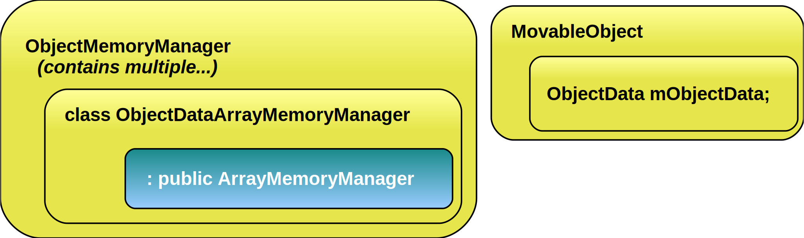

Technical Overview {#TechnicalOverview}
==================

@tableofcontents

# Overview {#TechnicalOverviewOverview}

`ArrayMemoryManager` is the base abstract system for handling SoA memory.
Derived classes (like `NodeArrayMemoryManager` or
`ObjecDataArrayMemoryManager`) provide a list of with the bytes needed for
each SoA pointer that will be used. I wrote [a few
slides](http://yosoygames.com.ar/wp/2013/07/ogre-2-0-memory-manager-slides-uploaded-gsoc/)
to [^4]help with understanding these concepts.

There is one `NodeArrayMemoryManager` per `Node` parent level. Root node is
parent level 0; the children of Root is parent level 1. And Root's
children's children are parent level 2.

There is also one `ObjectDataArrayMemoryManager` per Render Queue.

`NodeMemoryManager` is the main public interface, which handles all the
`NodeArrayMemoryManagers`.

Likewise, `ObjectDataMemoryManager` is the main public interface, which
handles all the `ObjectDataArrayMemoryManager`.

`NodeMemoryManager`

-   Multiple NodeArrayMemoryManager. One per parent level.

    -   Each one return a `Transform` (contain 4x4 Matrices, position,
        rotations, scale, the derived pos, rot, scales; etc) which is
        all SoA pointers.

`ObjectDataMemoryManager`

-   Multiple `ObjectDataArrayMemoryManager`. One per render queue.

    -   Each one return an `ObjectData` (contain Aabbs in local space, in
        world space, radius, visibility masks; etc) which is all SoA
        pointers.

## SIMD Coherence {#SIMDCoherence}

Using SSE2 single precision, OGRE usually processes 4 nodes/entities at
a time. However, if there is only 3 Nodes; we need to allocate memory
for 4 of them (`ArrayMemoryManager` already handles this) and initialize
the values to sane defaults even if they aren't used (eg. Set quaternion
& matrices to identity) to prevent NaNs during computations. Certain
architectures slowdown if one of the elements in an xmm register
contains a NaN.

Furthermore, [null pointers are not valid, but dummy pointers are used
instead](#DummyPointers).

SIMD Coherence is very important for both stability and performance, and
is 99% of the time responsability of the Memory Managers

# Memory Managers usage patterns {#MemoryManagerUsagePatterns}

`ArrayMemoryManagers` work with the concept of slots. When a Node asks for
a `Transform`, it is asking for a slot. When a `MovableObject` asks for an
`ObjectData`, it is asking for a slot.

In an SSE2 build, 4 slots make a block. How many slots are needed to
make a block depends on the value of the macro `ARRAY_PACKED_REALS`.

Slots are most efficient when requested and released in
[LIFO](http://en.wikipedia.org/wiki/LIFO_(computing)) order.

When LIFO order is not respected, a release (i.e. destroying a Node)
puts the released slot into a list. When a new slot is requested, the
one from the list is used and removed from it. When this list grows too
large, a cleanup will be performed. The cleanup threshold can be
tweaked.

## Cleanups {#MemoryManagerCleanups}

Cleanups happen when the number of slots released in non-LIFO order
grows too large. A cleanup will move memory so that it is contiguous
again.

Why are cleanups needed? Simply put, **performance**. Imagine the
following example (assuming `ARRAY_PACKED_REALS` = 4): The user created
20 nodes, named A through T:

> `ABCD EFGH IJKL MNOP QRST`

Then the user decides to delete nodes B, C, D, E, F, G, H, I, J, L, N,
O, P, Q, R, S, T; the resulting memory layout will be the following:

> `A*** **** **K* M*** ****`

where the asterisk `*` means an empty slot. When parsing the SoA arrays
(i.e. while updating the scene nodes, updating the MovableObject's world
Aabbs, frustum culling) everything is accessed sequentially.

The code will loop **4 times**, to process A, then nothing, then K, them
M. If `ARRAY_PACKED_REALS` would be 1; the code would loop 13 times.

This is obviously inefficient if it stays for a long time. During real
world application this issue won't impact performance if only done for 4
nodes, but if this kind of "fragmentation" is happening to thousands of
nodes, performance drop would be noticeable.

The cleanup will move all nodes to make them contiguous again:

`AKM* **** **** **** ****`

Hence the code will only loop once for SSE builds (or 3 times if
`ARRAY_PACKED_REALS` = 1)

# Memory preallocation {#MemoryPreallocation}

ArrayMemoryManagers preallocate a fixed amount of slots (always rounded
up to multiples of `ARRAY_PACKED_REALS`) specified at initialization
time.

When this limit is reached, the following may happen:

-   The buffer is resized. Any pointer to the slots will be invalidated
    (i.e. holding an external reference to Transform::mPosition). The
    Nodes & MovableObjects internal pointers are automatically updated.
-   The hard limit is reached (hard limit is also set at initialization
    time, the default is no limit). When this happens the memory manager
    will throw.

# Configuring memory managers {#ConfiguringMemoryManagers}

> **Note:** at the time of writing, memory managers have not a direct way of setting up the amount of preallocations or how often they perform cleanups.

# Where is RenderTarget::update? Why do I get errors in Viewport? {#RenderTargetUpdate}

Advanced users are probably used to low level manipulation of
RenderTargets. As such they're used to setting up their custom Viewports
and calling `RenderTarget::update`.

That is too low level. **Instead, users are now encouraged to setup
Compositor nodes and multiple workspaces to perform rendering to
multiple RTs, even if it's for your own custom stuff**. The new
Compositor is much more flexible than the old one (which has been
removed). See [section about
](#4.Compositor|outline)[Compositors](#4.Compositor|outline) for more
information.

Viewports are no longer associated with cameras as they're now stateless
(they used to cache the camera currently in use) and a lot of settings
they used to hold (like background colour, clear settings, etc) have
been moved to nodes. See `CompositorPassClearDef` and
`CompositorPassClear`.

`RenderTarget::update` has disappeared because the render scene update
has been [split in two stages, cull and
render](http://yosoygames.com.ar/wp/2013/09/shadow-mapping-nightmare/).

If you still insist in going low level, see the code on
`CompositorPassScene::execute` to understand how to prepare a
`RenderTarget` and render it manually. But again, we insist you should try
the Compositor.

# Porting from 1.x to 2.0 {#PortingV1ToV2}

You can port directly from 1.x to 2.1; however doing it in steps can be
a great as the changes are incremental and you can adapt to them while
also testing the new features step by step without being overwhelmed
with all the features at once and then figgure out what went wrong.

The main changes are:

-   The Compositor. Definitely the most noticeable change. The
    Compositor isn't just for postprocessing fancy effects anymore. It's
    a key component of Ogre. You need to tell Ogre how you want it to
    render your scene. You do that via the Compositor. See
    [Compositor](#4.Compositor|outline) chapter for more information.
-   Listeners. Ogre was listener-heavy. Every event had a listener for.
    This was crippling performance. Many listeners were removed, a few
    may not work. The most important listener now is
    `CompositorWorkspaceListener`. Also for custom rendering and injecting
    new Renderables, consider creating a custom pass via a
    `CompositorPassProvider`, which is the cleanest, most extensible way.
-   Behavior of SceneNodes, Lights and Cameras: Lights must be attached
    to a scene node. SceneNodes & Cameras shouldn't be modified once
    Ogre started rendering (e.g. inside a listener). If you still do it,
    in some cases calling `Node::_getTransformUpdated` can force the Node
    to update itself, but you still have to be careful. For example if
    you move the Camera's node, it's likely that frustum culling on
    objects and lights has already happened. So don't be surprised if
    objects disappear or don't get lit correctly. Be sure to test in
    Debug builds so that our aggressive asserts help you catch these
    issues.

# Porting from 2.0 to 2.1 {#PortingV20ToV21}

If you've already gone from 1.9 to 2.0 that's great. You're halfway
there. You can test that your Compositor setups works and you get used
to it, that no asserts get triggered, that everything shows up.

The two groundbreaking changes introduced between 2.0 and 2.1 are: the
v2 objects and the Hlms materials (aka `HlmsDatablock`)

The v2 objects, Item is the clear example of it. It's the new "Entity".
Item is faster (considerably faster depending on your scene).

If your preexisting engine is too complex to migrate Entity to Items;
leaving Entity is a reasonable choice. However if you're starting a new
project, Items is the best choice ([with certain
exceptions](#9.1.1.Longevity of the v1 objects and deprecation|outline)).
v1 objects do work and they still get quite good performance because
auto instancing works on them.

The difference between Items & Entity is that if you've got 100
instances of the same mesh with 5 materials that use the same texture
array; they will probably end up as just one draw call. Even if they're
Entity.

However, if you've got 100 different **meshes** (not instances of the
same mesh as in the previous example); Entity requires 100 draw calls,
while Items can still do it in 1 draw call.

Items also have a lower memory footprint CPU-side than Entities.

If you decide to keep Entity (which is probably what makes most sense
for existing codebases; if this is a new codebase or a simple one, then
Items all the way) probably the most annoying part will be writing the
"`v1::`" prefix for the namespace. Instead of Entity, it's now `v1::Entity`,
and so on with many multiple classes.

Then there's the materials. Here's where it's quite different but often
pleasant. In 1.x and 2.0; there was a `Renderable::setMaterial` function
(and `setMaterialName`). In 2.1; Materials are **severely discouraged**
and you should use Hlms datablocks instead (except for postprocessing).

There is a function `Renderable::setDatablockOrMaterialName` which, like
the name implies, "First tries to see if an HLMS datablock exist with
the given name, if not, tries to search among low level materials."
which is quite convenient when porting.

You'll have to port your Materials to PBS & Unlit Datablock equivalents.
In a Material, you would often define a vertex shader program, a pixel
shader program. Then link these programs to the material. Setup the auto
parameters. Then setup the texture units. Then setup the casters. It was
a lot of work. (and also write the shader in HLSL, GLSL, and whatever
else you needed to support).

It got worse if you wanted to selectively toggle features (e.g. toggle
normal mapping on / off; Hardware Skeletal animation, etc). You even had
to define multiple shader programs.

With Hlms datablocks you won't deal with any of that. Just setup the
textures, the colour parameters, and you're done. The Hlms will analyze
the Entity/Item when setting up the Datablock and create the appropriate
shaders based from a template.

Probably the most shocking part is if you had a lot of C++ code that
manipulated Materials directly (and its class members: `Technique`, `Pass`,
`TextureUnitState`), because HlmsDatablocks are completely different.
However if you dealt them via scripts, you won't have any issues.
Chances are though, that if you had code that manipulated Materials
directly, it was probably to do what the Hlms now does for you, and you
won't be needing it anymore.

And then you're set :)

If you want to customize the Hlms, [there's a very long and informative
section in this manual](#8.HLMS: High Level Material System|outline)
about its inner workings. How it analyzes the geometry information and
combines it with the pass' information (is this a shadow caster pass? a
receiver pass?) and only then generate the shader

Most users won't have to ever touch this, but if you're looking for a
very particular look or want to port your shaders from a previous
framework, it will depend on the amount of work you need to do: you may
want to just extend or modify the shader templates; or create your own
templates. Or modify the C++ side of the Hlms implementation. As a
recommendation, first see how the generated shaders look like (they get
dumped where Hlms::setDebugOutputPath says) and walk your way backwards
to the template to understand existing implementations.

[^4]:[Mirror 1](http://www.yosoygames.com.ar/other/GSoC-NodeMemoryManager-slides.7z);
    [Mirror 2](http://www.mediafire.com/?jgscslxbbp673nl)
