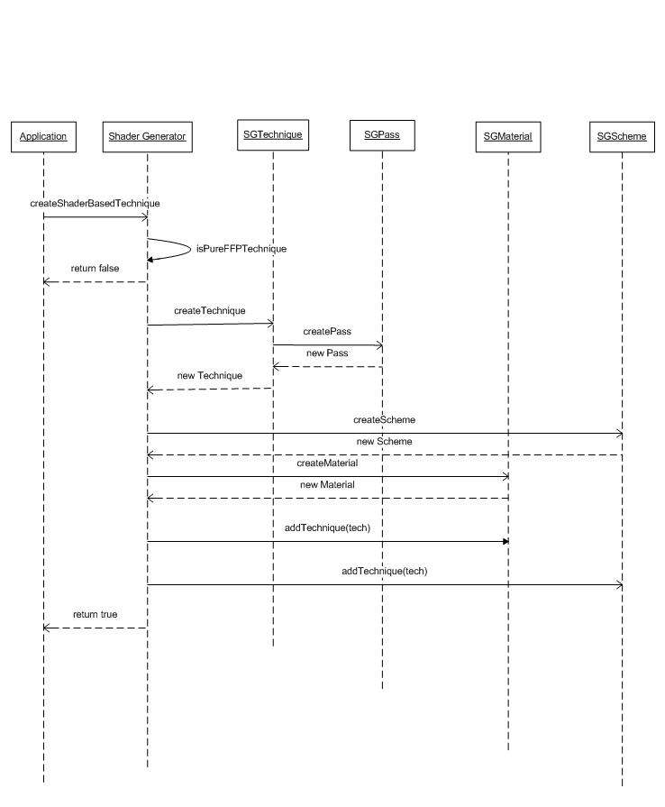
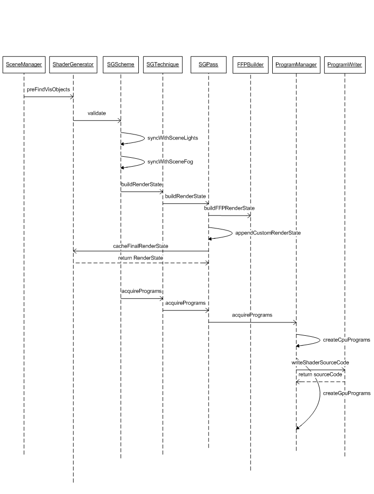

# Overview of the Run Time Shader System {#rtss}

The Run Time Shader System, or RTSS for short, is a component of Ogre. This component is used to generate shaders on the fly based on object material properties, scene setup and other user definitions.

@tableofcontents

# Core features of the system {#core-feats}
* Runtime shader generation synchronized with scene state. Each time scene settings change, a new set of shaders is generated.
* Full FFP (Fixed Function Pipeline) emulation. This feature is most useful combined with render system that doesn't provide any FFP functionality (OpenGL ES 2.0, D3D10, D3D11 etc).
* Shader language independent interface: the logic representation of the shader programs is completely independent from the target shader language. You can generate code for different shader languages from the same program.
* Pluggable interface allows extending the target shader languages set. 
* Pluggable interface allows adding new shader based effects to the system in a seamless way. Each effect code will be automatically combined with the rest of the shader code.
* Smart program management: each shader program is created only once and may be used by multiple passes.
* Automatic vertex shader compacting mechanism: no more compacting variables by hand. In case the amount of used vertex shader output registers exceeds the maximum allowed (12 to 32, depending on [D3DPSHADERCAPS2_0.NumTemps](http://msdn.microsoft.com/en-us/library/bb172918%28v=VS.85%29.aspx)), a compacting algorithm packs the vertex shader outputs and adds unpack code in the fragment shader side.
* Material script support, for both export and import.

# Integration of RTSS {#integration}

When the user asks the system to generate shaders for a given technique it has to provide the system a name for the target technique scheme. The system in turn, then creates a new technique based on the source technique but with a different scheme name. 
__Note:__ In order to avoid clashes the source technique must NOT contain any shaders otherwise this step will fail.

The idea behind this concept is to use Ogre's built in mechanism of material schemes, so all the user has to do in order to use the new technique is to change the material scheme of his viewport(s).

Before each viewport update, the system performs a validation step of all associated shader based techniques it created. This step includes automatic synchronization with the scene lights and fog states. When the system detects that a scheme is out of date it generates the appropriate shaders for each technique new.

The following steps are executed in order to generate shaders for a given technique:

* For each pass in the technique the system builds a set of sub render states that describe the logic process of the rendering pipeline from the draw call submission until the final pixel color.
* Each render state is translated into a set of logic shader programs (currently only pixel and vertex shader).
The logic programs are then sent to specific shader language writers that produce source code for the respective shader language. The source code is used to create the GPU programs that are applied to the destination pass.
Before rendering of an object that uses generated shaders the system allows each sub render state to update the GPU constants associated with it.

## Initializing the system
Initializing the system is composed of the following steps:
* Create the internal managers and structures via the `Ogre::RTShader::ShaderGenerator::initialize()` method.
* Set the target cache path. This is the place on your disk where the output shaders will be written to or will be read from in case they were generated by previous runs of your application.
* Verify that the location of the shader libs needed by the system is added to the ResourceGroupManager via the `Ogre::ResourceGroupManager::addResourceLocation()` method.
* Assign the target scene manager to the shader generator.
* Add one or more specialized sub-render states that are to be shared among all materials (per pixel lighting, textured fog, etc...). 

```cpp
if (Ogre::RTShader::ShaderGenerator::initialize())
{
	// Grab the shader generator pointer.
	mShaderGenerator = Ogre::RTShader::ShaderGenerator::getSingletonPtr();

	// Add the shader libs resource location. a sample shader lib can be found in Samples\Media\RTShaderLib
	Ogre::ResourceGroupManager::getSingleton().addResourceLocation(shaderLibPath, "FileSystem");

	// Set shader cache path.
	mShaderGenerator->setShaderCachePath(shaderCachePath);		

	// Set the scene manager.
	mShaderGenerator->addSceneManager(sceneMgr);
		
	// Add a specialized sub-render (per-pixel lighting) state to the default scheme render state
	Ogre::RTShader::RenderState* pMainRenderState = 
		mShaderGenerator->createOrRetrieveRenderState(Ogre::RTShader::ShaderGenerator::DEFAULT_SCHEME_NAME).first;
	pMainRenderState->reset();

	mShaderGenerator->addSubRenderStateFactory(new Ogre::RTShader::PerPixelLightingFactory);
	pMainRenderState->addTemplateSubRenderState(
		mShaderGenerator->createSubRenderState(Ogre::RTShader::PerPixelLighting::Type));	
	
	return true;
}
```

## Creating shader based technique
This step will associate the given technique with a destination shader generated based technique. Calling the `Ogre::RTShader::ShaderGenerator::createShaderBasedTechnique()` will cause the system to generate internal data structures associated with the source technique and will add new technique to the source material. This new technique will have the scheme name that was passed as an argument to this method and all its passes will contain shaders that the system will generate and update during the application runtime.

To use the generated technique set the change material scheme of your viewport(s) to the same scheme name you passed as argument to this method.

Note that you can automate the shader generation process for all materials. First set the viewport scheme to the destination scheme of the RTSS shaders. Second register to the `Ogre::MaterialManager::Listener` and implement the `handleSchemeNotFound()` function. If the function requests a scheme for the RTSS, generate it based on functions parameters.

```cpp
// Create shader based technique from the default technique of the given material.
mShaderGenerator->createShaderBasedTechnique("Examples/BeachStones", Ogre::MaterialManager::DEFAULT_SCHEME_NAME, Ogre::RTShader::ShaderGenerator::DEFAULT_SCHEME_NAME);

// Apply the shader generated based techniques.
mViewport->setMaterialScheme(Ogre::RTShader::ShaderGenerator::DEFAULT_SCHEME_NAME);
```


## Runtime shader generation
During the application runtime the ShaderGenerator instance receives notifications on per frame basis from its target SceneManager.
At this point it checks the material scheme in use. In case the current scheme has representations in the manager, it executes its validate method.
The SGScheme validation includes synchronization with scene light and fog settings. In case it is out of date it will rebuild all shader generated techniques.
The first step is to loop over every SGTechnique associated with this SGScheme and build its RenderStates - one for each pass. Each RenderState has its own hash code and it is cached at the ShaderGenerator. The same RenderState can be shared by multiple SGPasses.
The second step is to loop again on every SGTechnique and acquire a program set for each SGPass. The actual acquiring process is done by the ProgramManager that generates CPU program representation, send them to a matching ProgramWriter that is chosen by the active target language, the writer generates source code that is the basis for the GPU programs.
The result of this entire process is that each technique associated with the SGScheme has vertex and pixel shaders applied to all its passes. These shaders are synchronized with scene lights and fog settings.



# High system overview
# Main components
The following is an partial list of components within the RTSS. These components are listed as they have great importance in understanding controlling and later extending the RTSS system.

## ShaderGenerator
The ShaderGenerator is the main interface to the RTSS system. Through it you can request to generate and destroy the shaders, influence from what parts to create the shaders, and control general system settings such as the shading language and shader caching.

## RenderState classes
A render state describes the different components that a shader will be created from. These components are referred to as SubRenderStates. 

RenderStates exist on 2 levels: scheme and pass. Scheme RenderStates describe the SubRenderStates that will be used when creating a shader for a given material scheme. Pass RenderState describe the SubRenderStates that will be used when creating a specific pass of a specific material. When a shader is generated for a given material the system combines the SubRenderStates from both RenderStates to create a shader specific for a material pass in a specific scheme.

## SubRenderState classes
Sub-render states (SRS) are components designed to generate the code of the RTSS shaders. Each SRS usually has a specific role to fill within the shader's construction. These components can be combined in different combinations to create shaders with different capabilities.

There are 5 basic SRSs. These are used to recreate the functionality provided by the fixed pipeline and are added by default to every scheme RenderState:
* Ogre::RTShader::FFPTransform - responsible for adding code to the vertex shader which computes the position of the vertex in projection space
* Ogre::RTShader::FFPColour - responsible for adding code to the shaders that calculate the base diffuse and specular color of the object regardless of lights or textures. The color is calculated based on the ambient, diffuse, specular and emissive properties of the object and scene, color tracking and the specified hardware buffer color.
* Ogre::RTShader::FFPLighting - responsible for adding code to the shaders that calculate the luminescence added to the object by light. Then add that value to the color calculated by the color SRS stage.
* Ogre::RTShader::FFPTexturing - responsible for adding code that modulates the color of the pixels based on textures assigned to the material.
* Ogre::RTShader::FFPFog - responsible for adding code that modulates the color of a pixel based on the scene or object fog parameters.

__Note:__ There are many more sub render states that already exist in the Ogre system and new ones can be added. Some of the existing SRSs include capabilities such as: per-pixel lighting, texture atlas, advanced texture blend, bump mapping, efficient multiple lights (sample), textured fog (sample), etc...

## SubRenderStateFactory
As the name suggests, sub render state factories are factories that produce sub render states. Each factory generates a specific SRS. 

These type of components are note worthy for 2 reason. The first and obvious one is that they allow the system to generate new SRSs for the materials it is asked to generate. The second reason is that they perform as script readers and writers allowing the system to create specific or specialized SRSs per material.

# Creating custom shader extensions {#creating-extensions}
Although the system implements some common shader based effects such as per pixel lighting, normal map, etc., you may find it useful to write your own shader extensions.

In order to extend the system with your own shader effects you'll have to follow these steps:
* Implement the SubRenderState interface - This is the main class that is responsible for the actual effect processing such as preparing the destination pass, updating the CPU shader programs, updating the GPU shader parameters etc.
* Implement the SubRenderStateFactory interface: This class will allow the RTSS to create instances of the previous class via code or script as well as export it to material script file.
* Register the factory to the RTSS using the Ogre::RTShader::ShaderGenerator::addSubRenderStateFactory method.
* Add shader files that will supply all the actual shader functions your SubRenderState needs. In order to support multiple shader languages you should supply code for your entire desired target shading languages (CG, HLSL, GLSL etc). These files should be placed in a way that the resource manager could access them. This can be done by placing them in a valid resource location or by dynamically adding resource location.

Implementing the SubRenderState requires overriding the pure methods of the base class.
* Ogre::RTShader::SubRenderState::getType() should return unique string that identify the sub class implementation. That value is shared among all instances and can be stored in a static string variable. It uses to system to match between SubRenderState instance and the factory to should destroy it.
* Ogre::RTShader::SubRenderState::getExecutionOrder() should return integer value that will use the system to sort all SubRenderState instances of the same render state before each one of them will create its part in the CPU shader programs. Note that:
 * The execution order does not imply the order of the parameter definitions and function calls within the generated shader.
 * If an execution number is set to be the same as one of the basic fixed pipeline SRSs. Than that SRS will be built __instead__ of the fixed pipeline SRS.
* Ogre::RTShader::SubRenderState::copyFrom() a simple copy method that uses the system when coping one instance to another. **Note:** Only configuration data attributes should be copy here.
* Ogre::RTShader::SubRenderState::createCpuSubPrograms - This is the heart of this interface. This method should update the CPU shader programs with the specific details of the overriding class.

The SubRenderState supply default implementation for this method which break down this method into three stages:
* Resolving parameters: this stage should grab all the needed parameters for this SubRrenderState. In case of the FFPTransform it should resolve the world view projection matrix and vertex shader input and output position parameters.

```cpp
Program* vsProgram = programSet->getCpuVertexProgram();
	
// Resolve World View Projection Matrix.
ParameterPtr wvpMatrix = vsProgram->resolveAutoParameterInt(GpuProgramParameters::ACT_WORLDVIEWPROJ_MATRIX, 0);
if (wvpMatrix.get() == NULL)
	return false;
		
Function* vsEntry = vsProgram->getEntryPointFunction();
assert(vsEntry != NULL);

// Resolve input position parameter.
ParameterPtr positionIn = vsEntry->resolveInputParameter(Parameter::SPS_POSITION, 0, Parameter::SPC_POSITION_OBJECT_SPACE, GCT_FLOAT4);	
if (positionIn.get() == NULL)
	return false;
	

// Resolve output position parameter.
ParameterPtr positionOut = vsEntry->resolveOutputParameter(Parameter::SPS_POSITION, 0, Parameter::SPC_POSITION_PROJECTIVE_SPACE, GCT_FLOAT4);
if (positionOut.get() == NULL)
   return false;
```
* Resolving dependencies: this stage should provide the name of the external shader library files that contains the actual shader code needed by this SubRenderState.
In case of the FFPTexturing  it will add the common and texturing library for both vertex and pixel shader program.

```cpp
Program* vsProgram = programSet->getCpuVertexProgram();
Program* psProgram = programSet->getCpuFragmentProgram();

vsProgram->addDependency(FFP_LIB_COMMON);
vsProgram->addDependency(FFP_LIB_TEXTURING);	
psProgram->addDependency(FFP_LIB_COMMON);
psProgram->addDependency(FFP_LIB_TEXTURING);
```
* Adding function invocations: this stage creates the function calls within this SubRenderState requires. Each function call has two keys that are used by the system to sort it before generating the actual shader code as well as set of in/out parameters.
A function invocation is added to either vertex shader program or fragment shader program.
In case of the FFPFog it will add vertex depth calculation to the vertex shader program.

```cpp
curFuncInvocation = OGRE_NEW FunctionInvocation(FFP_FUNC_PIXELFOG_DEPTH, FFP_VS_FOG, internalCounter++);
curFuncInvocation->pushOperand(mWorldViewProjMatrix, Operand::OPS_IN);
curFuncInvocation->pushOperand(mVSInPos, Operand::OPS_IN);	
curFuncInvocation->pushOperand(mVSOutDepth, Operand::OPS_OUT);	
vsMain->addAtomInstace(curFuncInvocation);
```		

Note: 
* Each Ogre::RTShader::SubRenderState can add as many function invocations as it needs.
* Each Ogre::RTShader::SubRenderState can different function invocations in different ordering. 
* The ordering of the function invocation is crucial. Use the FFPVertexShaderStage and FFPFragmentShaderStage enumarations to place your invocations in the desired order.
* Make sure the parameter semantic (in/out) in the SubRenderState code matches to your shader code implementation you supplied in the library file. GLSL will fail to link to libray functions if it won't be able to find a perfect function declaration match. 
* Ogre::RTShader::SubRenderState::updateGpuProgramsParams - As the name suggest this method should be overridden only in case your SubRenderState should update some parameter it created before.
* Ogre::RTShader::SubRenderState::preAddToRenderState(): this method called before adding this SubRenderState to a parent RenderState instances. It allows this SubRenderState to exclude itself from the list in case the source pass is not matching. I.E in case of SubRenderState that perform lighting calculations it can return false when the given source pass specifies that lighting calculations disabled for it.

```cpp
if (srcPass->getLightingEnabled() == false)
	return false;
```

This method also let the SubRenderState to opportunity to modify the destination pass. I.E the NormalMapLighting instance adds the normal map texture unit in this context.

Implementing the SunRenderStateFactory is much simpler and involves implementing the following methods
* Ogre::RTShader::SubRenderStateFactory::createInstanceImpl(): This method should return instance for the SubRenderState sub class.
* Ogre::RTShader::SubRenderStateFactory::createInstance(): This method should return instasnce for the SubRenderState sub class using the given script compiler parameters. Implemet this method if you want to be able to creat your custom shader extension from material script.
* Ogre::RTShader::SubRenderStateFactory::writeInstance(): This method should write down the parameters of a given SubRenderState instance to material script file. Implement this method if you want to be able to export a material that contains your custom shader extension.

# Tips for debugging shaders {#debugging}
A couple of notes on debugging shaders coming from the RTSS:
* Go to OgreApplicationContext.cpp and define the preprocessor command `_RTSS_WRITE_SHADERS_TO_DISK`. This will cache the generated shaders onto the disk under the directory `{Ogre directory}\Samples\Media\RTShaderLib\cache`. This is important for 2 reasons:
  * It will make compilation problems easier to detect.
  * Once a shader is written to the disk, as long as you don't change the code behind it, the same shader will be picked up in the next application run even if its content has changed. If you have compilation or visual problems with the shader you can try to manually tinker with it without compiling the code again and again.
* Find the file OgreShaderProgramManager.h and add a breakpoint at `pGpuProgram.setNull();` (in createGpuProgram). If a shader will fail to compile it will usually fail there. Once that happens you can find the shader name under the `programName` parameter, then look for it in the cache directory you created.
* Other common problems with creating shaders in RTSS usually occur from defining vertex shader parameters and using them in the pixel shader and vice versa. so watch out for those.

# Historical background {#history}
When the early graphic cards came into the market they contained a fixed but large set of functions with which you could influence how 3D object were rendered. These included influencing object positions using matrices, calculating the effect of textures on a pixel, calculating the effect of lights on vertices and so on. These set of functions and their implementation in hardware became later known as the graphic card fixed pipeline (or Fixed Function Pipeline).

As graphic cards became more powerful and graphic application became more complex, a need for new ways to manipulate the rendering of 3D models became apparent. This need saw the introduction of shaders. 

Shaders are small custom made programs that run directly on the graphics card. Using these programs, one could replace the calculations that were made by the fixed pipeline and add new functionality. However there was a catch: If shaders are used on an object, the object can no longer use any of the functionality of the fixed pipeline. Any calculation that was used in the fixed pipeline needed to be recreated in the shaders. With early graphics applications this was not problematic. Shaders were simple and their numbers were kept low. However as applications grew in complexity this meant that the need for shaders grew as well. As a programmer you were left with 2 choices, both bad. Either create an exuberant amount of small shaders that soon became too many to effectively maintain. Or create an uber shader, a huge complex shader, that soon became too complex to effectively maintain as well.

The RTSS seeks to fix those problems by automatically generating shaders based on the operations previously required from the fixed pipeline and new capabilities required by the user.

With the introduction of the version 11 of Direct3D, a new reason for having an RTSS like system became apparent. With D3D11 support for fixed pipeline functionality was removed. Meaning, you can only render objects using shaders. The RTSS becomes an excellent tool for this purpose.

# Pros and Cons {#pros-cons}
Writing shading programs became a very common task when developing 3D based application during the last couple of years.
Most of the visual effects used by 3D based applications involve shader programs.
Here is just a short list of some common effects using shaders
* Hardware animation (a.k.a hardware skinning)
* Soft shadows
* Normal/Bump maps
* Specular maps
* Advanced multi-texturing effects

Writing shaders by hand is in many cases the best solution as one has full control of the shader code and hence optimizations based on the target scene nature can be made, etc.

So why use a runtime shader system anyway?

* Save development time e.g. when your target scene has dynamic lights and the number changes, fog changes, ... and the number of material attributes increases the total count of needed shaders dramatically. It can easily cross 100 and it becomes a time consuming development task.
* Reusable code - once you've written the shader extension you can use it anywhere due to its independent nature.
* Custom shaders extension library - enjoy the shared library of effects created by the community. Unlike hand written shader code, which may require many adjustments to be plugged into your own shader code, using the extensions library requires minimum changes.
