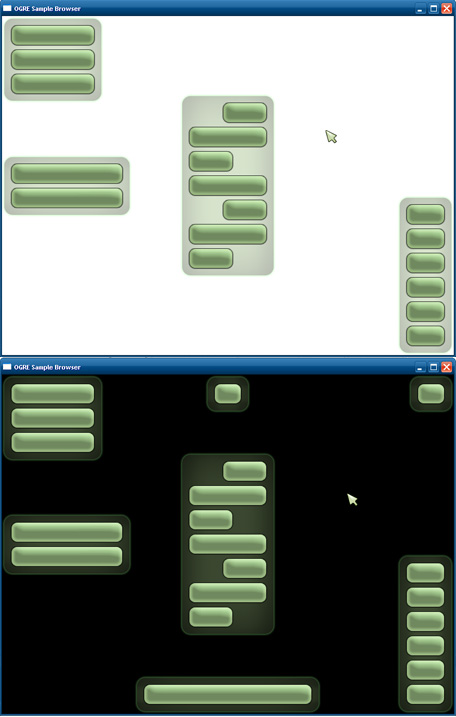

# Trays GUI System {#trays}

Ever wanted really simple GUI controls for your sample? Don't want to write one from scratch, but CEGUI's just a little too much? The Trays system was created to address this issue. It's a simple GUI system based on the OGRE @ref Overlays system and designed just for samples. Because it's simple, you're not going to be able to skin it or build very unique interfaces, but you'll also find it much easier to use.

@tableofcontents

# Trays {#trays-1}
Why trays? The concept of trays is central to the system in that it removes the need for the GUI designer (you) to calculate or specify positional coordinates of any kind. Think about the widget locations in a typical GUI. They are almost always in any of the four corners, along any of the four edges or, on the rare occasion, in the center of the screen. In Trays, there are nine "trays", one in each of the locations previously mentioned. When you create a widget, you specify one of these nine locations, and the widget will be added to the tray at that location. Your widget will be added directly beneath the last widget in that tray. When you add a widget to a tray, the tray grows in size. Trays along the top of the screen grow downward, Trays along the bottom grow upward, and the trays in the middle row grow vertically in both directions. Visually, the trays are semi-transparent panels that fit the widgets they contain. Only non-empty trays are visible. If this is hard to visualise, don't worry, here's a picture to help you out.


# TrayManager {#traymanager}
To use Trays, you have to create an TrayManager. This is the class through which you will create and manage all your widgets, manipulate the cursor, change the backdrop image, adjust tray properties, pop up dialogs, show/hide the loading bar, etc. You can have multiple tray managers in one application. For example, the OGRE Sample Browser uses its own tray manager and hides it when a sample is running, and the SDK samples also have their own tray managers, which are hidden when the samples are paused by the browser. 

@note The TrayManager requires `Trays.zip`, so you can only create it after loading that resource. Also, make sure you're correctly initialized the @ref Overlays Component as the Trays Framework depends on it.

Create your tray manager like so:
```cpp
OgreBites::TrayManager* mTrayMgr = new OgreBites::TrayManager("InterfaceName", mWindow);
```
You must pass in a name for your interface and a Ogre::RenderWindow. Optionally pass a `OgreBites::TrayListener` as a third argument if you want to be notified on e.g. button press. You can extend your sample or sample context to be a tray listener. Remember to destroy your tray manager like so:
```cpp
delete mTrayMgr;
```
Once you have your tray manager, make sure you relay input events to it.
```cpp
addInputListener(mTrayMgr);
```
@note In case you also want to handle the events yourself:
The listener methods on TrayManager return true if the event was relevant to the tray manager, and should not be processed again by you. For example, if you click a button that is over an interactive part of your scene, you want the button to be pressed, but you don't want the scene interaction to take place. So the listener methods double as filters for your mouse events.

You're now free to create widgets! Try adding a button to the top-left tray:
```cpp
Button* b = mTrayMgr->createButton(TL_TOPLEFT, "MyButton", "Click Me!");
```
TrayManager is a huge class, and you can do tons of things with it. For some examples, see the Things to Try section below.

## The Cursor
The cursor has three parts in the Trays system: The layer it moves around in Overlay, the container which positions the cursor (OverlayContainer), and the cursor image, which is a child of the container (OverlayElement). When hiding/showing the cursor, the entire cursor layer is hidden/shown. The top left corner of the cursor container is used as the hotspot of the cursor. By positioning the cursor image relative to the cursor container, you can basically decide which part of the cursor image is the "clicking part". For the default arrow cursor, the image is simply lined up with the container, meaning the top left is the hotspot. However, for something like a crosshair cursor, you could move the cursor image so that its center is over the top left corner of the cursor container. To show the cursor, use `OgreBites::TrayManager::showCursor`, which takes an optional material name for the cursor image. If unspecified, the cursor image is not changed. To hide the cursor, use `OgreBites::TrayManager::hideCursor`. You can get the cursor's different parts using getCursorLayer, getCursorContainer, and getCursorImage. Note that if the cursor is hidden, all interactions with widgets are disabled.

## The Backdrop
If you want to show a backdrop, use `OgreBites::TrayManager::showBackdrop`, which takes an optional material name for the backdrop. If unspecified, the backdrop image is not changed. To hide it, use `OgreBites::TrayManager::hideBackdrop`.

# Widgets {#widgets}
There are 10 basic widgets. Each widget is just an instance of an OverlayElement template, and all widgets use {LEX()}pixel{LEX} metrics. You can get access to any widget's underlying OverlayElement through `OgreBites::Widget::getOverlayElement`. Do not instantiate and delete widgets manually. Create and destroy them using the TrayManager. The first argument to any one of TrayManager's widget creation methods is the location of the tray you want the widget to be in. This is of the enumerated type TrayLocation. The second argument is the name of your widget (this is not your widget's caption, but a unique string identifier for your widget). The rest of the arguments are specific to the type of widget. 

## Button
This is the most basic widget of all. To create a button, use `OgreBites::TrayManager::createButton`. In addition to a tray location and a name, you must specify a caption for your button, and an optional width. If width is not specified, the button will automatically resize to fit its caption. There are no button states. You only get notified when a button is pushed. To see how to respond to button push events, see the TrayListener section below.

## TextBox
This widget consists of a bold caption bar and a text area that can be scrolled vertically. In addition to a tray location and a name, `OgreBites::TrayManager::createTextBox` takes a caption, width, and height. You can set/get the caption, the text area contents, text padding, text alignment, manually change the scroll bar position, among other things.

## SelectMenu
A basic drop-down menu. To create it, use `OgreBites::TrayManager::createLongSelectMenu` or `OgreBites::TrayManager::createThickSelectMenu`. Both these methods return a SelectMenu object, but they give one of two different visual styles to the widget. One is thicker, but shorter, because it places the caption over the item box. This style of menu is good for putting in the side trays. The other is longer, but thinner, because it places the item box next to the caption. This style of menu is good for putting in the top or bottom trays. createThickSelectMenu takes a tray location, a name, a caption, the width of the whole widget, the maximum number of visible items when expanded, and an optional string vector of items. The medthod `createLongSelectMenu` takes nearly the same arguments, except that it needs the width of the text box that shows the currently selected item. Also, for long menus, it is optional to specify the total width because it will automatically resize to fit the item box and the caption. You can set/get the caption, and set/get the items in many different ways. You can also manually change the selection, with the option of not firing an event. To see how to respond to menu item selection events, see the TrayListener section below.

## Label
A big, semi-transparent, tabby-looking label. This widget uses a different font from the rest of the widgets, and is good for section headings and such. In addition to a tray location and a name, `OgreBites::TrayManager::createLabel` takes a caption, and an optional width. If the width is not specified, the label automatically adjusts its width to fill the tray it's currently in, so it matches the other contents of the tray. Labels can also be clicked. To see how to respond to label click events, see the TrayListener section below.

## Separator
A horizontal line which looks like it was etched into the tray. Good for dividing up other widgets into sections without taking up as much space as a label. `TrayManager::createSeparator` takes a tray location, name, and an optional width. If the width is not specified, the behaviour is the same as a Label's.

## Slider
A slider bar consists of a container box, a small text box to display the value, and a track + handle. Sliders are type-agnostic. Using three parameters - a minimum value, a maximum value, and the number of "snapping points", you can give your slider track of any kind of discrete scale - integer, floating point, or even nominal. Snapping points are basically the "steps" on your slider track. By specifying how many of them there are, you are in effect specifying an entire range of values all the way from your minimum value to your maximum value. Let's say you have minimum value 0, maximum value 1, and 6 snapping points. Underneath the surface, each slider stores a floating point value, so in this case you would be able to display 6 floating point values: {0, 0.2, 0.4, 0.6, 0.8, 1}. The slider will display your value in the cleanest way possible (using `Ogre::StringConverter::toString`). This means that if all your values happen to land on integers, then they will be displayed as integers without decimals. You can also exploit this by using your slider's integer values as indices into an array of string values, and manually set your slider's value to the new string value. Basically, you can make your slider display things like Low, Medium, High, 1/4, 3/4, $4.00, N/A, etc. This requires you to respond to slider move events. More on this in the TrayListener section below. Then your Like select menus, sliders also come in two flavours - thick and long. The thick style places the caption and the value box above the track, while the long style places the caption, track, and value box side by side in that order. `OgreBites::TrayManager::createThickSlider` takes a tray location, name, caption, total width, value box width, minimum value, maximum value, and the number of snapping points. `OgreBites::TrayManager::createLongSlider` takes a an optional total width, track width, value box width, minimum value, maximum value, and the number of snapping points. If the total width is not specified, the slider will automatically scale to fit the track, the value box, and the caption text. You can get/set the slider's caption, displayed value, actual value, and range of values. When you change the range, the value is reset to be the minimum value. When you change the value, you also have the option of not firing an event. To respond to slider move events, see the TrayListener section below.

## ParamsPanel
This panel displays an arbitrary number of parameters and their values. This could be anything you want. For example, the stats panel in the SDK samples shows the average framerate, best framerate, batch count, etc. The details panel in the SDK samples shows the texture filtering technique, the polygon mode, and the camera position and orientation. To create a ParamsPanel, use `OgreBites::TrayManager::createParamsPanel`, which takes a tray location, a name, a width, and then either a string vector of parameter names or the number of parameters (lines) to leave room for. The parameter names will be left justified, and their values will be right justified on the same line. At any time, you can set/get the parameter names and values either one at a time, or all at once using a string vector.

## CheckBox
Self-explanatory. `OgreBites::TrayManager::createCheckBox` takes a tray location, name, caption, and an optional width. Unspecified width means auto-fit to caption. You can set/get the state of the check box, with the option of not triggering an event. To respond to check box state change events, see the TrayListener section below.
## DecorWidget
This widget takes any OverlayElement template, and creates a widget out of it. If you want to put your own picture, icons, or other static objects into the trays, make an OverlayElement template out of it, and then turn it into a DecorWidget. `OgreBites::TrayManager::createDecorWidget` takes a tray location, a name, and an OverlayElement template name. These are basically the same things you would normally use to create an OverlayElement from a template. The OGRE logo in the SDK samples is a DecorWidget.
## ProgressBar
A progress bar with a caption, a comment/details box, and a meter that fills up. `OgreBites::TrayManager::createProgressBar` takes a tray location, a name, a caption, a total width, and comment box width. You can use progress bars to show any kind of progress you want, but for the most common kind (loading resources), there's a special instance of ProgressBar already created by TrayManager which you can use. See Loading Bar below.

## The Null Tray
In addition to the nine trays you can place your widgets in, there is also a "null tray". This is an imaginary tray, whose location is specified by `TL_NONE`. This tray is virtual, invisible, and does not arrange widgets within it. Basically, if you place a widget in this tray, it becomes "free-floating", and you're allowed to manually position it anywhere on the screen. Widgets must always reside in a tray for as long as they exist, so when a widget is removed from a tray, it is automatically placed in the null tray.

# Special Widgets {#special-widgets}
Some widgets are so common they deserve special treatment.

## Frame Stats
This is not exactly one widget, but a combination of Label that displays the current FPS, and a ParamsPanel that displays advanced frame statistics (such as average FPS and batch count). Use `OgreBites::TrayManager::showFrameStats` and `OgreBites::TrayManager::hideFrameStats` to show/hide this special widget. You can choose where to put it. When the user clicks the FPS label, it toggles the visibility of the advanced frame stats, so they can be out of the way when they're unwanted. You can also manually toggle the visibility of the advanced frame stats using `OgreBites::TrayManager::toggleAdvancedFrameStats`.

## Logo
This is just a decor widget of the OGRE logo. Use `OgreBites::TrayManager::showLogo` and `OgreBites::TrayManager::hideLogo` to show/hide the logo. You can choose where to put it.

## Loading Bar
This is a progress bar that shows you the progress of your current resource loading job. The comment box will show the current resource being loaded. Use `OgreBites::TrayManager::showLoadingBar` before you begin your loading job. Specify the number of resource groups you will initialise, the number of groups you will load, and, if you want to, the proportion of time you think will go to initialisation (default estimate is 70%). You cannot decide where to place this loading bar. The screen will be darkened, and the loading bar will appear in the center. Any other dialog or loading bar will be closed. When you finish your loading job, call `OgreBites::TrayManager::hideLoadingBar`.

## Information Dialog
This is a dialog which tells the user something and displays an OK button. It's a combination of a TextBox and a Button. Use `OgreBites::TrayManager::showOkDialog` to display an information dialog. Specify the caption of the TextBox, and the message you want to display in it. Any other dialog or loading bar will be closed. The screen will be darkened, and the dialog will appear in the center. All other widget interactions are disabled until the dialog is closed. You can manually close a dialog using `OgreBites::TrayManager::closeDialog`. To respond to information dialog closing events, see the TrayListenersection below.

## Question Dialog
Same as the Information Dialog except it asks the user something and displays a Yes button and a No button. Use `OgreBites::TrayManager::showYesNoDialog` to display a question dialog. Specify the caption of the TextBox, and the question you want to display in it. To respond to question dialog closing events, see the TrayListener section below.

# TrayListener {#tray-listener}
This class contains handlers for all the different events that your widgets can fire. The TrayManager class itself is an TrayListener, because it responds to events from its special widgets. You should extend your sample class from TrayListener as well as Sample if you want to handle widget events. If you're using SdkSample, you're all set because it's already an TrayListener. Some widgets give you an option of not firing an event when you change their state. This is helpful for initialising or resetting a widget, in which case there shouldn't be a response of any sort. For example, if you're initialising your slider bar before the scene is set up, and your slider bar is used to control some part of your scene, firing an event would cause an error. Below is a list of the different handlers. All handlers have return type void.
* __buttonHit__: Gives you a pointer to the Button which was hit.
* __itemSelected__: Gives you a pointer to the SelectMenu the item was chosen from. You can then use the SelectMenu to see which item was selected.
* __labelHit__: Gives you a pointer to the Label that was clicked.
* __sliderMoved__: Gives you a pointer to the Slider whose value was changed. You can then use the Slider to see what its new value is. Also, you can convert this value into a more suitable form and display it using Slider::setDisplayedValue.
* __checkBoxToggled__: Gives you a pointer to the CheckBox whose state was changed. You can then use the CheckBox to see if it's been checked or unchecked.
* __okDialogClosed__: Gives you the message of the OK dialog that was closed.
* __yesNoDialogClosed__: Gives you the question of the Yes-No dialog that was closed, and a boolean indicating whether or not the Yes button was pressed.

# Things to Try {#things-to-try}
Getting access to widgets:
```cpp
Button* b;
b = (Button*)mTrayMgr->getWidget("MyButton");  // by name
b = (Button*)mTrayMgr->getWidget(TL_LEFT, 0);  // by tray and position
b = (Button*)mTrayMgr->getWidget(TL_LEFT, "MyButton");  // by tray and name
b = (Button*)mTrayMgr->getWidgets(TL_LEFT).front();  // by tray
```
Counting widgets:
```cpp
unsigned int n = mTrayMgr->getNumWidgets();  // total
unsigned int n = mTrayMgr->getNumWidgets(TL_LEFT);  // by tray
```
Moving widgets to other trays:
```cpp
mTrayMgr->moveWidgetToTray(b, TL_TOP);
mTrayMgr->moveWidgetToTray(b, TL_BOTTOM, 1);
mTrayMgr->moveWidgetToTray(TL_BOTTOM, 1, TL_RIGHT, 3);
mTrayMgr->moveWidgetToTray(TL_RIGHT, 3, TL_BOTTOM);
mTrayMgr->moveWidgetToTray("MyButton", TL_TOP);
mTrayMgr->moveWidgetToTray(TL_TOP, "MyButton", TL_LEFT);
```
Removing widgets from trays:
```cpp
mTrayMgr->removeWidgetFromTray(b);
mTrayMgr->removeWidgetFromTray("MyButton");
mTrayMgr->removeWidgetFromTray(TL_LEFT, 0);
mTrayMgr->moveWidgetToTray(b, TL_NONE);
mTrayMgr->clearTray(TL_LEFT);
mTrayMgr->clearAllTrays();
```
Destroying widgets:
```cpp
mTrayMgr->destroyWidget(b);
mTrayMgr->destroyWidget("MyButton");
mTrayMgr->destroyWidget(TL_LEFT, 0);
mTrayMgr->destroyAllWidgetsInTray(TL_LEFT);
mTrayMgr->destroyAllWidgets();
```
Finding the position of a widget in a tray:
```cpp
unsigned int pos = mTrayMgr->locateWidgetInTray(b);
```
Finding the tray a widget is in:
```cpp
TrayLocation trayLoc = b->getTrayLocation();
```
Changing the tray listener object:
```cpp
mTrayMgr->setListener(newListener);
```
Toggling system visibility:
```cpp
mTrayMgr->showAll();
mTrayMgr->hideAll();
```
Changing horizontal widget alignment in one tray:
```cpp
mTrayMgr->setTrayWidgetAlignment(TL_LEFT, GHA_RIGHT);
```
Changing spacing and padding:
```cpp
mTrayMgr->setWidgetSpacing(5);
mTrayMgr->setWidgetPadding(3);
mTrayMgr->setTrayPadding(12);
```
Casting 3D ray from under cursor into the scene:
```cpp
Ray r = mTrayMgr->getCursorRay(mCamera);
```
Casting 3D ray from any 2D screen coordinate into the scene:
```cpp
Ray r = OgreBites::TrayManager::screenToScene(mCamera, Vector2(320, 240));
```
Converting a 3D scene coordinate to a 2D screen coordinate:
```cpp
Vector2 p = OgreBites::TrayManager::sceneToScreen(mCamera, Vector3::ZERO);
```
