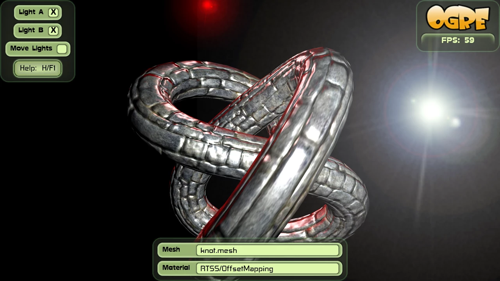
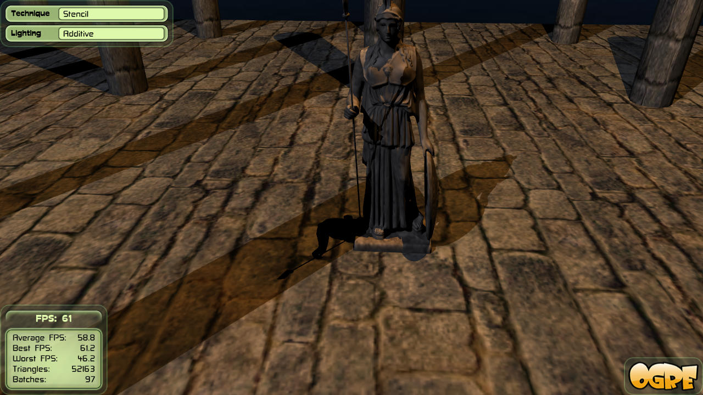
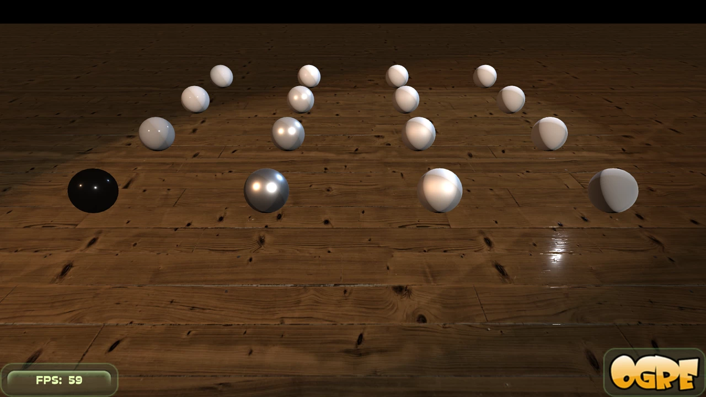
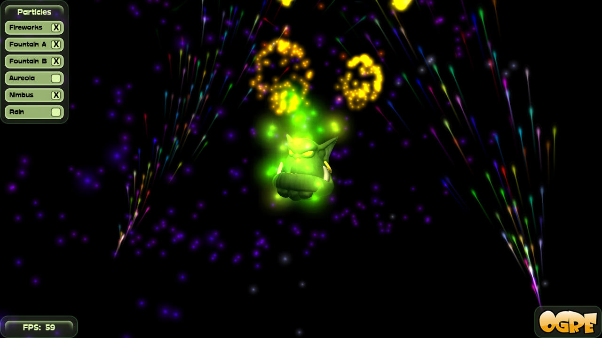
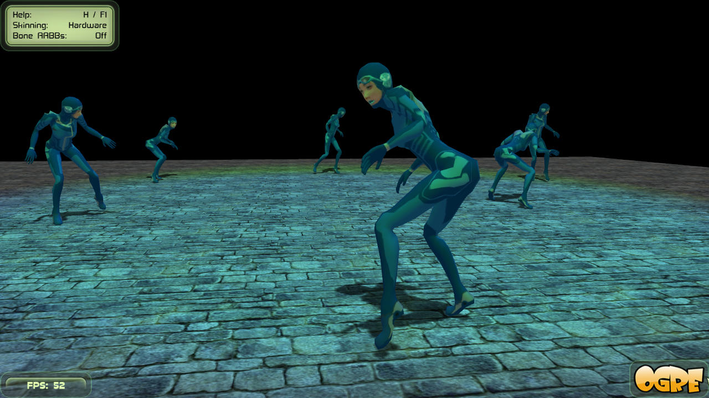
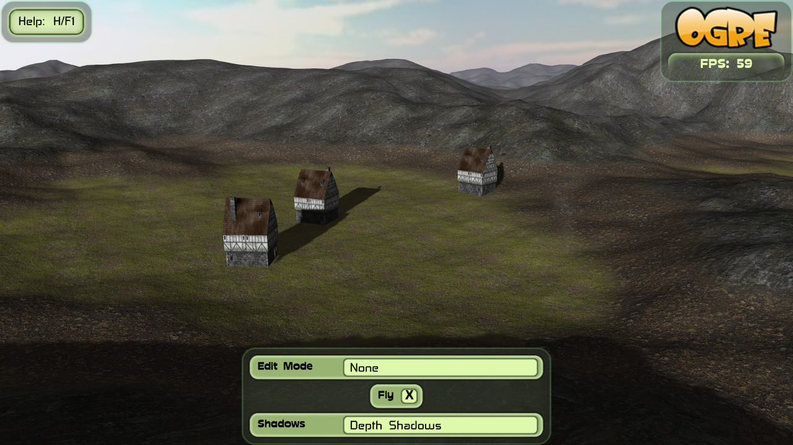
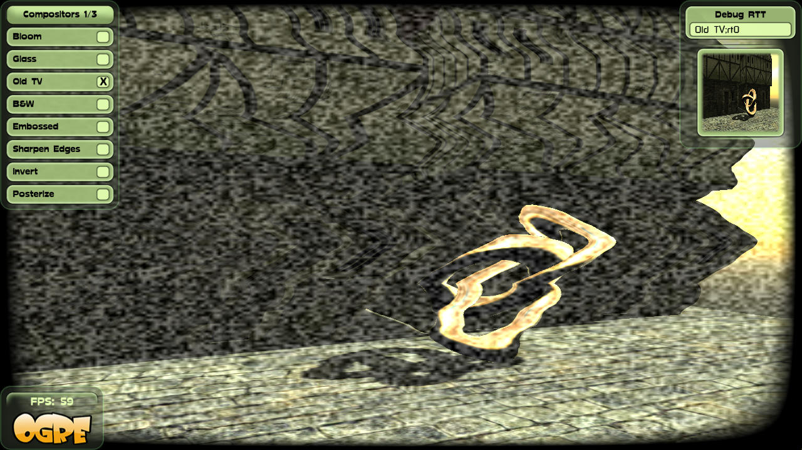
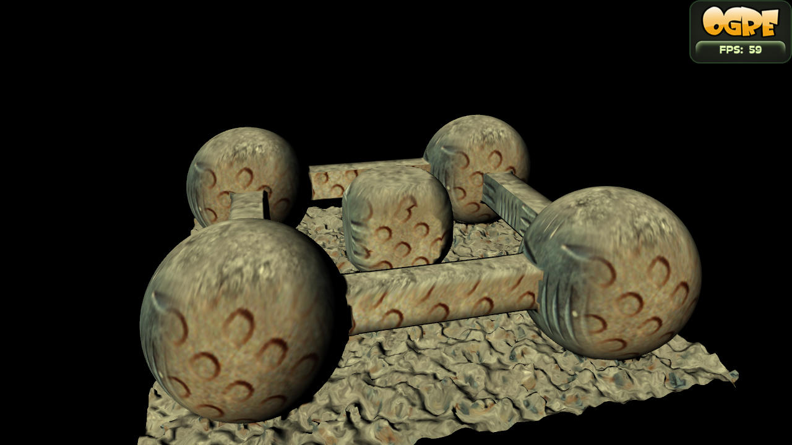
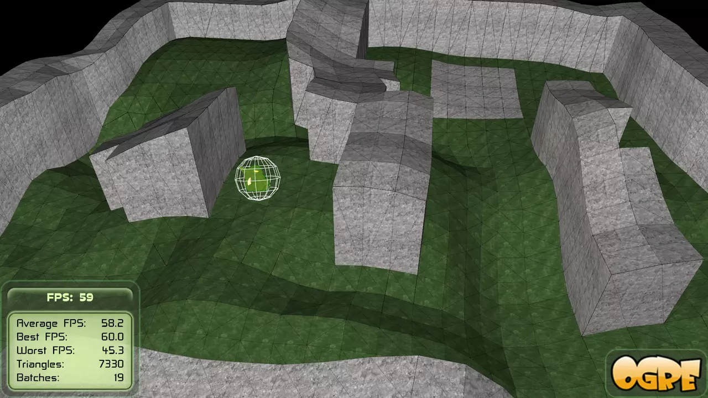

[](https://github.com/OGRECave/ogre/releases/latest)
[](https://pepy.tech/project/ogre-python)
[](https://gitter.im/OGRECave/ogre?utm_source=badge&utm_medium=badge&utm_campaign=pr-badge&utm_content=badge)
[](https://www.patreon.com/ogre1)


## OGRE - scene-oriented, flexible 3D engine

**OGRE** (Object-Oriented Graphics Rendering Engine) is a
scene-oriented, flexible 3D engine written in C++ designed to make it
easier and more intuitive for developers to produce games and demos
utilising 3D hardware. The class library abstracts all the details of
using the underlying system libraries like Direct3D and OpenGL and
provides an interface based on world objects and other intuitive
classes.

[Try it](#try-it) -
[Building](https://ogrecave.github.io/ogre/api/latest/building-ogre.html) -
[Tutorials](https://ogrecave.github.io/ogre/api/latest/tutorials.html) -
[Manual](https://ogrecave.github.io/ogre/api/latest/manual.html) -
[What's New?](Docs/14-Notes.md) -
[Who is using it?](#who-is-using-it) -
[Community Support](http://forums.ogre3d.org/)


## Features

For an exhaustive list, see the [features page](http://www.ogre3d.org/about/features) and try our Sample Browser. For a quick overview see below

| Integrated Bump and Offset Mapping | Integrated shadows |
|----|----|
|  |  |

| Physically Based Shading | Particle Effects |
|----|----|
|  |  |

| HW & SW skeletal animation | Multi-layer Terrain |
|----|----|
|  |  |

| Automatic Rendertarget pipelining (Compositors) | Volume Rendering with CSG & Triplanar Texturing |
|----|----|
|  |  |

| [Dear ImGui](https://github.com/ocornut/imgui) | [Bullet Physics](https://pybullet.org/) Integration |
|----|----|
|  |  |

## Try it
* [Online Emscripten Demo](https://ogrecave.github.io/ogre/emscripten/)
* [Windows Demos Distribution](https://dl.cloudsmith.io/public/ogrecave/ogre/raw/versions/master/ogre-sdk-master-msvc142-x64.zip)
* [Linux Snap Package](https://snapcraft.io/ogre)
* [Android App on F-Droid](https://f-droid.org/packages/org.ogre.browser/)

## Who is using it?

**Open Source**
- [Stunt Rally 2.x - 3D Racing Game with Track Editor](https://github.com/stuntrally/stuntrally/)
- [Rigs of Rods - Soft Body Physics Simulator](https://rigsofrods.org/)
- [Gazebo - Robot simulation](http://gazebosim.org/)
- [OpenCV OVIS visualization module](https://docs.opencv.org/master/d2/d17/group__ovis.html)
- [ROS 3D visualization tool](http://wiki.ros.org/rviz)
- [Surgical Image Toolkit](https://github.com/IRCAD/sight#applications)

**Closed Source**
- [Hob](http://store.steampowered.com/app/404680/Hob/)
- [Torchlight II](http://store.steampowered.com/app/200710/Torchlight_II/)
- [Battlezone 98 Redux](http://store.steampowered.com/app/301650/Battlezone_98_Redux/)

## Citing
If you use Ogre in your research, please cite it like this:

```bibtex
  @misc{rojtberg2024ogre,
    author = "{Rojtberg, Pavel and Rogers, David and Streeting, Steve and others}",
    title = "OGRE scene-oriented, flexible 3D engine",
    year = "2001 -- 2024",
    howpublished = "\url{https://www.ogre3d.org/}",
  }
```

## Contributing
We welcome all contributions to OGRE, be that new
plugins, bugfixes, extensions, tutorials, documentation, example
applications, artwork or pretty much anything else! If you would like
to contribute to the development of OGRE, please create a [pull request](https://github.com/OGRECave/ogre/pulls).

| Build | Status |
|-------|-----------------|
| Linux, OSX, Android, iOS | [](https://github.com/OGRECave/ogre/actions?query=branch%3Amaster) |
| MSVC | [](https://ci.appveyor.com/project/paroj/ogre-bsrh7/branch/master) |

## Licensing
Please see the [full license documentation](Docs/License.md) for details.
